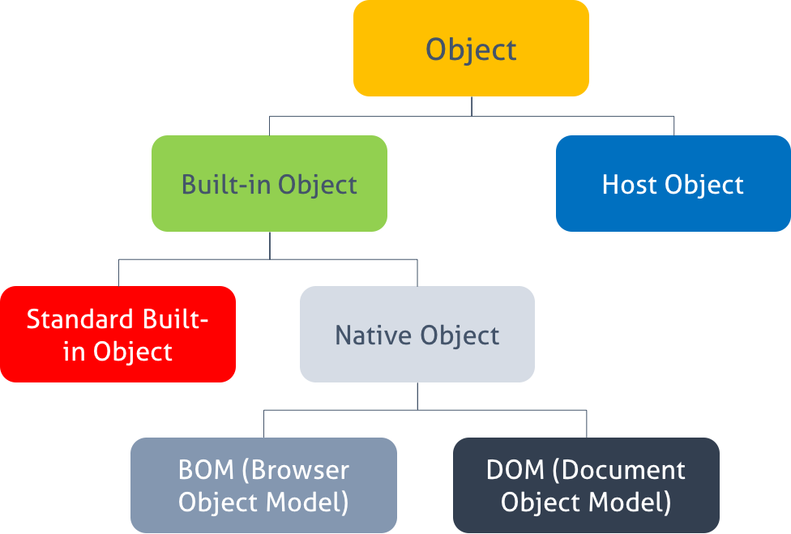

170731

# Javascript Object

## 1. 객체(Object)란?
- 자바스크립트는 객체기반의 스크립트 언어이며 이루고 있는 거의 모든것은 객체이다
- 객체 = 키 + 데이터 + 동작
  - 이름(키) + 값으로 구성된 데이터(프로퍼티) + 동작을 나타내는(메서드)

### 1.1 프로퍼티(Property)
- 객체는 이름(name)과 값(value)의 쌍인 프로퍼티들을 포함하는 컨테이너라고 할 수 있다.
  - 프로퍼티 이름 : 빈 문자열을 포함하는 문자열과 숫자
  - 프로퍼티 값 : undefined을 제외한 모든 값

### 1.2 메서드(Method)
- 메서드는 객체에 제한되어 있는 `함수를 의미`한다. 

## 2. 객체 생성 방법
- 자바스크립트는 클래스라는 개념이 없고 별도의 객체 생성 방법이 존재한다.
  - 객체 리터럴, object() 생성자 함수, 생성자 함수 3가지의 방법이 존재한다.

### 2.1 객체 리터럴
- 중괄호({})를 사용하여 객체를 생성하는데 {} 내에 아무것도 기술하지 않으면 빈 객체가 생성된다. 
- {} 내에 1개 이상의 `프로퍼티 이름(Property name): 프로퍼티 값(Property value)`을 기술하면 해당 프로퍼티가 추가된 객체를 생성할 수 있다.

```javascript
var emptyObject = {};  // empty object 즉 property가 없다.
console.log(typeof emptyObject); // object

var person = {
  name: 'Lee',
  gender: 'male',
  sayHello: function () {
    console.log('Hi! My name is ' + this.name);
  }
};

console.log(typeof person); // object
console.log(person); // { name: 'Lee', gender: 'male', sayHello: [Function: sayHello] }

person.sayHello(); // Hi! My name is Lee
```

> person은 2개의 property(name,gender)와 1개의 method(syHello())를 가지고 있다.

> 객체내에서 method가 다른 property를 선택할때는 this를 가르킨다.

### 2.2 Object() 생성자 함수
- new 연산자와 `Object() 생성자 함수`를 사용하여 빈 객체를 생성할 수 있다.

```javascript
// 빈 객체의 생성
var person = new Object();
// 프로퍼티 추가
person.name = 'Lee';
person.gender = 'male';
person.sayHello = function () {
  console.log('Hi! My name is ' + this.name);
};

console.log(typeof person); // object
console.log(person); // { name: 'Lee', gender: 'male', sayHello: [Function] }

person.sayHello(); // Hi! My name is Lee

```

- `객체 리터럴 방식으로 생성된 객체`는 결국 내장(Built-in) 함수인 Object() 생성자 함수로 객체를 생성하는 것을 단순화 시킨 `short-hand(축약법)이다.`

### 2.3 생성자 함수
- 동일한 프로퍼티를 갖는 객체를 한번에 만든다.

```javascript
// 생성자 함수
function Person(name, gender) {
  this.name = name;
  this.gender = gender;
  this.sayHello = function(){
    console.log('Hi! My name is ' + this.name);
  };
}

// 인스턴스의 생성
var person1 = new Person('Lee', 'male');
var person2 = new Person('Kim', 'female');

console.log('person1: ', typeof person1);
console.log('person2: ', typeof person2);
console.log('person1: ', person1);
console.log('person2: ', person2);

person1.sayHello();
person2.sayHello();
```

- 생성자 함수 이름은 일반적으로 `대문자`로 시작한다.
- 프로퍼티 또는 메서드명 앞에 기술한 `this는 생성자 함수로 생성될 인스턴스(instance)를 가리킨다.` 따라서 this에 연결되어 있는 프로퍼티와 메서드는 `public`이다.
- 생성자 함수 내에서 선언된 일반 변수는 `private`이다. 즉 생성자 함수 내부에서는 자유롭게 접근이 가능하나 `외부에서 접근할 수 있는 방법이 없다.`

```javascript
function Person(name, gender) {
  var married = 'yes';        // private
  this.name = name;           // public
  this.gender = gender;       // public
  this.sayHello = function(){ // public
    console.log('Hi! My name is ' + this.name);
  };
}

var person = new Person('Lee', 'male');

console.log(typeof person);
console.log(person);

console.log(person.gender);  // 'male'
console.log(person.married); // undefined
```

## 3. 객체 프로퍼티 접근

### 3.1 프로퍼티 이름
- ''로 묶어주는 이유는 - 를 연산자로 인식하기 때문이다.
  - last_name(Snake) = ok, lastName(Kamel) = ok, last-name(kebab) = no (일반적으로 카멜사용)
-  프로퍼티 값은 undefined을 제외한 모든 값과 표현식이 올 수 있으며 `프로퍼티 값이 함수인 경우 이를 메서드라 한다.`
- 예약어를 프로퍼티 이름으로 사용하여서는 않된다.

```javascript
var person = {
  'first-name': 'Ung-mo',
  'last-name': 'Lee',
  gender: 'male',
  function: 1 // OK. 하지만 예약어는 사용하지 말아야 한다.
};

console.log(person.function);
```

### 3.2 프로퍼티 값 읽기
- 객체의 프로퍼티에 접근하는 방법
  - 마침표 . 표기법
  - 대괄호 [] 표기법 -> kebab 형식일때 사용한다.

  ```javascript
  var person = {
    'first-name': 'Ung-mo',
    'last-name': 'Lee',
    gender: 'male',
  };

  console.log(person);

  console.log(person.first-name);    // NaN: undefined-name
  console.log(person[first-name]);   // ReferenceError: first is not defined
  console.log(person['first-name']); // 'Ung-mo'

  console.log(person.gender);    // 'male'
  console.log(person[gender]);   // ReferenceError: gender is not defined
  console.log(person['gender']); // 'male'

  ```

- 객체에 존재하지 않는 프로퍼티를 참조하면 `undefined를 반환한다.`

```javascript
var person = {
  'first-name': 'Ung-mo',
  'last-name': 'Lee',
  gender: 'male',
};

console.log(person.age); // undefined
```

### 3.3 프로퍼티 값 갱신
- 새로운 값을 할당하면 프로퍼티 값은 갱신된다.

```javascript
var person = {
  'first-name': 'Ung-mo',
  'last-name': 'Lee',
  gender: 'male',
};

person['first-name'] = 'Kim';
console.log(person['first-name'] ); // 'Kim'

```

### 3,4 프로퍼티 동적 생성
- 객체가 소유하고 있지 않은 프로퍼티에 값을 할당하면 하면 해당 프로퍼티를 객체에 추가하고 값을 할당한다.

```javascript
var person = {
  'first-name': 'Ung-mo',
  'last-name': 'Lee',
  gender: 'male',
};

person.age = 20;
console.log(person.age); // 20
```

### 3.5 프로퍼티 삭제
- delete 연산자를 사용하여서 삭제가능하다.
  - 객체에다가 delete를 사용하면 무시된다.
```javascript
var person = {
  'first-name': 'Ung-mo',
  'last-name': 'Lee',
  gender: 'male',
};

delete person.gender;
console.log(person.gender); // undefined

delete person;
console.log(person); // Object {first-name: 'Ung-mo', last-name: 'Lee'}
```

### 3.6 for-in 문
- for-in 문을 사용하면 객체에 포함된 모든 프로퍼티에 대해 루프를 수행할 수 있다.
- 사용하지 않는 것이좋다. ES6에서 새로추가된 `for-of` 를 사용하여라.
  - 순서가 보장되지 않고, 만들지 않은 값이 같이 나오기도 한다.

## 4. Pass-by-reference
- 참조형이란? 객체의 모든 연산이 실제값이 아닌 참조값으로 처리됨을 의미한다.
- 객체형과 다르게 기본자료형의 값은 값(value)으로 전달된다. 즉, 복사되어 전달된다. 이를 pass-by-value라 하며 한번 값이 정해지면 변경할 수 없다(immutable).

```javascript
// Pass-by-reference
var foo = {
  val: 10
}

var bar = foo;
console.log(foo.val, bar.val); // 10 10
console.log(foo === bar);      // true

bar.val = 20;  // val에 20을 넣으면 bar도 자동으로 반영된다 둘은 reference관계라서 그렇다.
console.log(foo.val, bar.val); // 20 20
console.log(foo === bar);      // true
```
- pass-by-reference는 변수 foo, bar 모두 동일한 객체를 참조하고 있다. 따라서 참조하고 있는 객체의 val 값이 변경되면 변수 foo, bar 모두 동일한 객체를 참조하고 있으므로 `두 변수 모두 변경된 객체의 프로퍼티 값을 참조`하게 된다. 객체는 참조(Reference) 방식으로 전달된다. `결코 복사되지 않는다.`

- 예) pass-by-value

``` javascript
var foo = { val: 10 };
var bar = { val: 10 };

console.log(foo.val, bar.val); // 10 10
console.log(foo === bar);      // false

var baz = bar;

console.log(baz.val, bar.val); // 10 10
console.log(baz === bar);      // true
```
- foo와 변수 bar는 비록 내용을 같지만 별개의 객체를 생성하여 참조값을 할당하였다. 따라서 변수 foo와 변수 bar의 `참조값은 동일하지 않다.`

- 변수 baz에는 변수 bar의 값을 할당하였다. 결국 변수 baz와 변수 bar는 동일한 객체를 가리키는 참조값을 저장하고 있다. 따라서 `변수 baz와 변수 bar의 참조값은 동일하다.`

## 5. Pass-by-value
- 기본자료형의 값은 값(value)으로 전달된다. 즉, `복사되어 전달된다.` 이를 pass-by-value라 한다. 기본자료형은 `값이 한번 정해지면 변경할 수 없다.(immutable)`

```javascript
// Pass-by-value
var a = 1;
var b = a;

console.log(a, b);    // 1  1
console.log(a === b); // true

a = 10;
console.log(a, b);    // 10  1
console.log(a === b); // false
```

## 6. 객체의 분류
- 객체는 아래와 같이 분류된다.
;

  - DOM : 정보를 가진 객체이다.
  - BOM : browser를 컨트롤하기위한 객체들을 나타낸다.