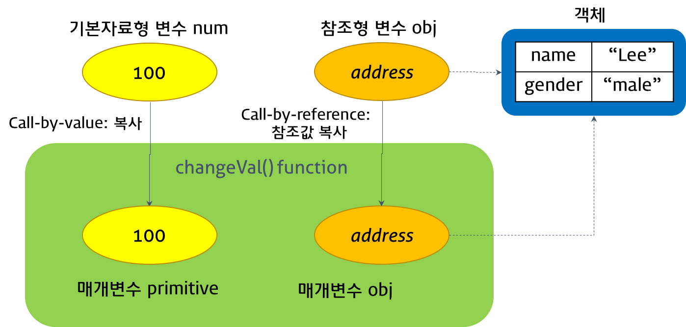
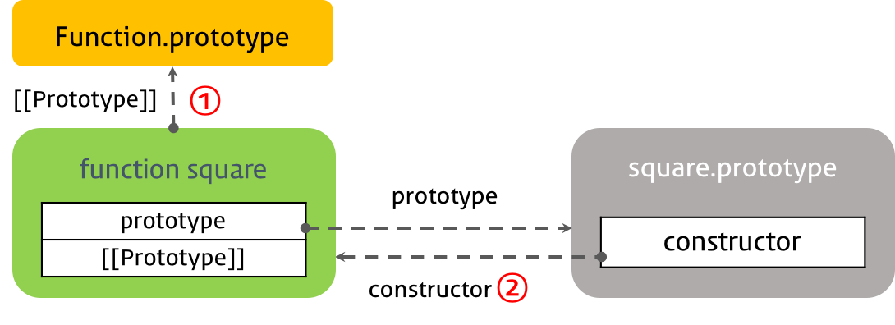

170801

# Javascript Function
- 함수란 어떤 특정 작업을 수행하기 위해 필요한 일련의 구문들을 그룹화하기 위한 개념이다.(코드의 재사용)
- 함수의 기능
  - 특정 작업을 수행하는 구문들의 집합을 정의하고 필요시에 호출하여 필요한 값 또는 수행 결과를 얻는다.
  - 객체 생성, 객체의 행위 지정(메서드)
  - 정보의 구성 및 은닉, 클로저, 모듈화 등의 기능을 수행할 수 있다.
- 함수는 구문(statement)의 집합으로 모듈화의 근간이 된다.

- `함수도 객체이다.` 다른 객체와 구분될 수 있는 특징은 호출할 수 있다는 것이다.
- 변수나 객체, 배열 등에 저장될 수 있고 다른 함수에 전달되는 인수로도 사용될 수 있으며 함수의 반환값이 될 수도 있다.
> 호출 : 함수를 실행시키는 행위

## 1. 함수 정의
- 함수선언식(Function declaration)
- 함수표현식(Function expression)
- Function() 생성자 함수

### 1.1 함수선언식(Function declaration)
- 함수선언식을 사용한 함수 정의는 function 키워드와 이하의 내용으로 구성된다.
  - 함수명 : 함수명은 생략할 수 없다. 식별자의 역할을 한다.
  - 매개변수 목록 : 0개 이상의 목록으로 괄호로 감싸고 콤마로 분리한다.
    - 자료형 체크가 필요할 수 있다.
  > tpyeof로 자료형을 체크한다. typeof num==='number' && !!num 이렇게 비교한다.

  - 함수 몸체 : 중괄호({ })로 구문들을 감싸고 return 문으로 결과값을 반환할 수 있다. 이를 반환값(return value)라 한다.

  ```javascript
    function square(number) {
    return number * number;
  }
  ```
  > number = 매개변수 = parameter

### 1.2 함수표현식(Function expression)
- 자바스크립트의 함수는 일급객체이다.
  - 무명의 리터럴로 표현이 가능하다.
  - 변수나 자료 구조(객체, 배열…)에 저장할 수 있다.
  - 함수의 파라미터로 전달할 수 있다.
  - 반환값(return value)으로 사용할 수 있다.
- 함수표현식이란? 함수 리터럴 방식으로 함수를 정의하고 변수에 할당하는 방식이다.

```javascript
var square = function(number) {
  return number * number;
};
```

- 함수표현식으로 정의한 함수는 함수명을 생략할 수 있다. 이러한 함수를 익명 함수(anonymous function)이라 한다.
```javascript
// 기명 함수표현식(named function expression) 재귀함수, 디버그
var foo = function multiply(a, b) {
  return a * b;
};
// 익명 함수표현식(anonymous function expression)
var bar = function(a, b) {
  return a * b;
};

console.log(foo(10, 5)); // 50
console.log(multiply(10, 5)); // Uncaught ReferenceError: multiply is not defined

```
- 함수 호출시 변수가 함수명처럼 사용된다.
- 함수가 할당된 변수를 사용해 함수를 호출하지 않고 기명 함수의 함수명을 사용해 호출하게 되면 에러가 발생한다. `이는 함수표현식에서 사용한 함수명은 외부 코드에서 접근 불가능하기 때문이다.`
> 기명 함수표현식은 재귀함수, 디버그를 할 때 필요하다.


```javascript
var foo = function(a, b) {
  return a * b;
};

var bar = foo;

console.log(foo(10, 10)); // 100 , 10을 argument, 인수라한다.
console.log(bar(10, 10)); // 100
```
- 변수 bar와 변수 foo는 동일한 익명 함수의 참조값을 갖는다.

```javascript
var square = function square(number) {
  return number * number;
};
```
- 함수명과 함수 참조값을 가진 변수명이 일치하므로 함수명으로 호출되는 듯 보이지만 `사실은 변수명으로 호출된 것이다.`  
- 결국 함수선언식도 함수표현식과 동일하게 `함수 리터럴 방식으로 정의되는 것이다.`


### 1.3 Function() 생성자 함수

- 함수선언식과 함수표현식은 모두 함수 리터럴 방식으로 함수를 정의하는데 이것은 결국 `내장 함수 Function() 생성자 함수로 함수를 생성하는 것을 단순화 시킨 것이다.`

```javascript
var square = new Function('number', 'return number * number');
console.log(square(10)); // 100
```

## 2. 함수 호이스팅(Function Hoisting)
- 위의 3가지 함수 정의 방식은 동작 방식에 약간의 차이가 있다.

- 예) 밑에는 함수선언식이다. -> `이 방법을 사용하지 말아라. 반드시 호출전에 선언할 것.`
```javascript
var res = square(5);

function square(number) {
  return number * number;
}
```
- 함수 선언의 위치와는 상관없이 코드 내 어느 곳에서든지 호출이 가능한데 이것을 함수 호이스팅(Function Hoisting)이라 한다.

- `자바스크립트는 ES6의 let, const를 포함하여 모든 선언(var, let, const, function, function*, class)을 호이스팅(Hoisting)한다.`

- 함수선언식으로 정의된 함수는 자바스크립트 엔진이 스크립트가 로딩되는 시점에 바로 초기화하고 이를 VO(variable object)에 저장한다.` 즉, 함수 선언, 초기화, 할당이 한번에 이루어진다.`

- 예) 밑에는 함수표현식으로 함수를 정의 -> `이방법 변수호이스팅만 발생 이것을 사용.`
```javascript
var res = square(5); // TypeError: square is not a function

var square = function(number) {
  return number * number;
}
```
- 함수선언식의 경우와는 달리 TypeError가 발생하였다. `함수표현식의 경우 함수 호이스팅이 아니라 변수 호이스팅이 발생한다.`
  > 변수 호이스팅은 변수 생성 및 초기화와 할당이 분리되어 진행된다. 호이스팅된 변수는 undefined로 초기화 되고 실제값의 할당은 할당문에서 이루어진다.
- `함수표현식`은 함수선언식과는 달리 스크립트 로딩 시점에 변수 객체(VO)에 함수를 할당하지 않고 `runtime에 해석`되고 실행되므로 이 두가지를 구분하는 것은 중요하다.
- 함수선언식으로 함수를 정의하면 사용하기에 쉽지만 대규모 애플리케이션을 개발하는 경우 인터프리터가 너무 많은 코드를 변수 객체(VO)에 저장하므로 애플리케이션의 응답속도는 현저히 떨어질 수 있으므로 주의해야 할 필요가 있다.

## 3. First-class object (일급 객체)
- 일급 객체(first-class object)란? 생성, 대입, 연산, 인자 또는 반환값으로서의 전달 등 프로그래밍 언어의 기본적 조작을 제한없이 사용할 수 있는 대상을 의미한다.
  - 무명의 리터럴로 표현이 가능하다.
    - 예) var foo = function() { ~~ }  // 함수의 이름이 없다.
  - 변수나 자료 구조(객체, 배열…)에 저장할 수 있다.
  - 함수의 파라미터로 전달할 수 있다.
  - 반환값(return value)으로 사용할 수 있다.

```javascript
// 1. 무명의 리터럴로 표현이 가능하다.
// 2. 변수나 데이터 구조안에 담을 수 있다.
var increase = function(num) {
  return num + 1;
};

var decrease = function(num){
  return num - 1;
};

var obj = {
  increase: increase,
  decrease: decrease
};

// 3. 함수의 파라미터로 전달 할 수 있다.
function calc(func, num){
  return func(num);
}

console.log(calc(increase, 1));
console.log(calc(decrease, 1));

// 4. 반환값(return value)으로 사용할 수 있다.
function calc(mode){
  var funcs = {
    plus:  function(left, right){ return left + right; },
    minus: function(left, right){ return left - right; }
  };
  return funcs[mode]; // funcs.mode 로하면 mode라는 요소를 찾는다 하지만 이것은 잘못된것 func[mode]로해야한다.
}
console.log(calc('plus')(2,1));
console.log(calc('minus')(2,1));
```
- avascript의 함수는 위의 조건을 모두 만족하므로 `Javascript의 함수는 일급객체이다.`
- `함수와 다른 객체를 구분 짖는 특징은 호출할 수 있다는 것이다.`

## 4. 매개변수(Parameter, 인자)
- 함수의 작업 실행을 위해 추가적인 정보가 필요할 경우, 매개변수를 지정한다. 매개변수는 함수 내에서 변수와 동일하게 동작한다.

### 4.1 매개변수(parameter, 인자) vs 인수(argument)
- 매개변수는 함수 내에서 변수와 동일하게 메모리 공간을 확보하며 전달되어진 인수는 매개변수에 할당된다. 만약 인수가 전달되지 않으면 매개변수는 undefined로 초기화된다.

```javascript
var foo = function (p1, p2) {  // p1,p2은 parameter 인자이다.
  console.log(p1, p2);
};

foo(1); // 1 undefined    -> 1은 인수이다.
```

### 4.2 Call-by-value
- Primitives(기본자료형) 인수는 `Call-by-value(값에 의한 호출)`로 동작한다.
- 함수 호출 시 기본자료형 인수를 함수에 매개변수로 전달할 때 매개변수에 값을 `복사하여 함수로 전달`하는 방식이다. 
-  함수 내에서 매개변수를 통해 값이 변경되어도 전달이 완료된 기본자료형 값은 변경되지 않는다.

```javascript
function foo(primitive) {
  primitive += 1;
  return primitive;
}

var x = 0;

console.log(foo(x)); // 1
console.log(x);      // 0 -> 기본자료형 값은 변경되지 않는다.

```

### 4.3 Call-by-reference
- 객체 타입(참조 타입) 인수는 `Call-by-reference(참조에 의한 호출)`로 동작한다.
- 함수 호출 시 참조 타입 인수를 함수에 매개변수로 전달할 때 `매개변수에 값이 복사되지 않고 객체의 참조값이 매개변수에 저장되어 함수로 전달`되는 방식이다.
- 함수 내에서 매개변수의 참조값이 이용하여 객체의 값을 변경했을 때 전달되어진 참조형의 인수값도 같이 변경된다.

```javascript
function changeVal(primitive, obj) {
  primitive += 100;
  obj.name = 'Kim';
  obj.gender = 'female';
}

var num = 100;
var obj = {
  name: 'Lee',
  gender: 'male'
};

console.log(num); // 100
console.log(obj); // Object {name: 'Lee', gender: 'male'}

changeVal(num, obj);

console.log(num); // 100
console.log(obj); // Object {name: 'Kim', gender: 'female'}

```
- num은 기본자료형이라서 call-by-value로 복사만 되고 obj은 참조형(객체) 변수라서 call-by-reference여서 kim, female이 들어간다.
;

## 5. 반환값 (return value)
- 함수는 자신을 호출한 코드에게 수행한 결과를 반환(return)할 수 있다.
  - return 키워드는 함수를 호출한 코드에게 값을 반환할 때 사용한다.
  - 함수는 배열 등을 이용하여 한 번에 여러 개의 값을 리턴할 수 있다.
  - 함수는 반환을 생략할 수 있다. 이때 함수는 암묵적으로 undefined를 반환한다.
  - 자바스크립트 해석기는 return 키워드를 만나면 함수의 실행을 중단한 후, 함수를 호출한 코드로 되돌아간다. 만일 return 키워드 이후에 다른 구문이 존재하면 그 구문은 실행되지 않는다.

```javascript
function calculateArea(width, height) {
  var area = width * height;
  return area; // 단일 값의 반환
}
console.log(calculateArea(3, 5)); // 15
console.log(calculateArea(8, 5)); // 40

function getSize(width, height, depth) {
  var area = width * height;
  var volume = width * height * depth;
  return [area, volume]; // 복수 값의 반환
}

console.log('area is ' + getSize(3, 2, 3)[0]);   // area is 6
console.log('volume is ' + getSize(3, 2, 3)[1]); // volume is 18
```

## 6. 함수 객체의 프로퍼티
- 함수는 객체이다. 따라서 함수도 프로퍼티를 가질 수 있다.

```javascript
function square(number) {
  return number * number;
}

square.x = 10;
square.y = 20;

console.log(square.x, square.y); // 10, 20

```
- 함수는 일반 객체와는 다른 함수만의 표준 프로퍼티를 갖는다.

```javascript
function square(number) {
  return number * number;
}
console.dir(square); 
```

### 6.1 arguments 프로퍼티
- arguments 객체는 함수 호출 시 전달된 인수(argument)들의 정보를 담고 있는 순회가능한(iterable) 유사 배열 객체(array-like object)이다.
- 함수 객체의 arguments 프로퍼티는 arguments 객체를 값으로 가지며 함수 내부에서 지역변수처럼 사용된다. 즉 함수 외부에서는 사용할 수 없다

```javascript
function multiply(x, y) {
  console.log(arguments);
  return x * y;
}

console.log(multiply());     // {}
console.log(multiply(1));    // { '0': 1 }
console.log(multiply(1,2));  // { '0': 1, '1': 2 }
console.log(multiply(1,2,3));// { '0': 1, '1': 2, '2': 3 }
```

- 매개변수(parameter)는 인수(argument)로 초기화된다
  - 매개변수의 갯수보다 인수를 적게 전달했을 때(multiply(), multiply(1)) 인수가 `전달되지 않은 매개변수는 undefined으로 초기화된다.`
  - 매개변수의 갯수보다 인수를 더 많이 전달한 경우, `초과된 인수는 무시된다.`

- 즉 arguments 객체는 매개변수 갯수가 확정되지 않은 `가변 인자 함수를 구현할 때` 유용하게 사용된다.

```javascript
function sum() {
  var res = 0;

  for (var i=0; i<arguments.length; i++) {
    res += arguments[i];
  }

  return res;
}

console.log(sum());      // 0
console.log(sum(1,2));   // 3
console.log(sum(1,2,3)); // 6
```

- arguments 객체는 배열의 형태로 인자값 정보를 담고 있지만 실제 배열이 아닌 `유사배열객체(array-like object)이다.`

> 유사배열객체란 length 프로퍼티를 가진 객체를 말한다. 배열 메서드를 사용하려면 `Function.prototype.call, Function.prototype.apply`를 사용하여야 하는 번거로움이 있다.

```javascript
function sum() {
  // arguments 객체를 배열로 변환
  var array = Array.prototype.slice.call(arguments);
  return array.reduce(function (pre, cur) {
    return pre + cur;
  });
}

console.log(sum(1, 2, 3, 4, 5)); // 15

```
- call 함수를 사용하여서 arguments객체를 배열로 변환하였다.

### 6.2 caller 프로퍼티
- caller 프로퍼티는 자신을 호출한 함수를 의미한다.

```javascript
function foo(func) {
  var res = func();
  return res;
}

function bar() {
  if (bar.caller == null) { 
    return 'The function was called from the top!';
  } else {
    return 'This function\'s caller :\n' + bar.caller;
  }
}

console.log(foo(bar));
console.log(bar());

```
> bar.caller == null인경우는 전역에서 바로 부르는것 

### 6.3 length 프로퍼티
- length 프로퍼티는 함수 정의 시 작성된 매개변수 갯수를 의미한다.

```javascript
function foo() {}
console.log(foo.length); // 0

function bar(x) {
  return x;
}
console.log(bar.length); // 1

function baz(x, y) {
  return x * y;
}
console.log(baz.length); // 2

```

### 6.4 name 프로퍼티
- 함수명을 나타낸다. 기명함수의 경우 함수명을 값으로 갖고 익명함수의 경우 빈문자열을 값으로 갖는다.

```javascript
// 기명 함수표현식(named function expression)
var namedFunc = function multiply(a, b) {
  return a * b;
};
// 익명 함수표현식(anonymous function expression)
var anonymousFunc = function(a, b) {
  return a * b;
};

console.log(namedFunc.name);     // multiply
console.log(anonymousFunc.name); // ''
```

### 6.5 __proto__ 프로퍼티
- ECMAScript spec에서는 `모든 객체는 자신의 프로토타입을 가리키는 [[Prototype]]이라는 숨겨진 프로퍼티를 가진다` 라고 되어있다. -> `부모가 있다라는 의미이다.`
  -  __proto__과 [[Prototype]]은 같은 개념이다.

  >  __proto__로 부모를 찾을 수 있다. 최상위는 object.prototype이다. 자식은 부모의 것을 사용할 수 있고 그 반대는 안된다.

```javascript
function square(number) {
  return number * number;
}

console.dir(square);
```
- 함수의 프로토타입 객체는 Function.prototype이며 이것 역시 함수이다.
> square.__proto__를 하면 squre의 부모인 Function prototype이 나온다.

### 6.6 prototype 프로퍼티

```javascript
var foo = new Person();
```

> 생성자함수<Person() 생성자>가 foo 객체를 만들었을때 생성자 이름에 prototype이 붙은 애<Person.prototype>가 양부의 역할을 하는데 이때 <Person.prototype>은 foo객체의 부모이며 <Person.prototype>의 부모는 Object-prototype이고 Person() 생성자의 prototype을 Person.prototype이라고 불른다. 이때 Person() 생성자의 부모는 funtion-prototype이다. 다들 똑같은 객체이다.

- 함수 객체만이 가지고 있는 프로퍼티으로 자바스크립트 객체지향의 근간이다.
- `모든 함수 객체는 prototype 프로퍼티를 갖는다. 주의해야 할 것은 prototype 프로퍼티는 프로토타입 객체를 가리키는 [[Prototype]] 프로퍼티(__proto__ 프로퍼티)와는 다르다는 것이다.`
- [[Prototype]] 프로퍼티
  - 모든 객체가 가지고 있는 프로퍼티이다.
  - `객체의 입장에서 자신의 부모 역할을 하는 프로토타입 객체을 가리키며 함수 객체의 경우 Function.prototype를 가리킨다.`
  - 생성한 객체가 부모를 가르킬때 사용한다.

- prototype 프로퍼티
  - 함수 객체만 가지고 있는 프로퍼티이다.
  - `함수 객체가 생성자로 사용될 때 이 함수를 통해 생성된 객체의 부모 역할을 하는 객체를 가리킨다.`
  - 함수가 생성될 때 만들어 지며 constructor 프로퍼티를 가지는 객체를 가리킨다. 이 constructor 프로퍼티는 함수 객체 자신을 가리킨다.
  - 생성자 함수가 생성한 객체의 부모역할을 할 객체를 가르킨다.
  - constructor 프로퍼티는 Person.prototype이 Person 생성자 함수를 가르킨다.


```javascript
function square(number) {
  return number * number;
}

// console.dir(square);
console.dir(square.__proto__);
console.dir(square.prototype);

console.log(square.__proto__ === Function.prototype); // true ①
console.log(square.__proto__ === square.prototype);   // false
console.log(square.prototype.constructor === square); // true ②
console.log(square.__proto__.constructor === square.prototype.constructor); // false
```
- `[[Prototype]] 프로퍼티는 함수 객체의 부모 객체(Function.prototype)를 가리키며 prototype 프로퍼티는 함수객체가 생성자 함수로 사용되어 객체를 생성할 때 생성된 객체의 부모 객체 역할을 하는 객체를 가리킨다.`
;

## 7. 함수의 다양한 형태

### 7.1 즉시호출함수표현식 (`IIFE`, Immediately Invoke Function Expression)
- 함수의 `정의(선언)와 동시에 실행(호출)`되는 함수를 즉시호출함수라고 한다. 최초 한번만 호출되며 다시 호출할 수는 없다. 이러한 특징을 이용하여 최초 한번만 실행이 필요한 초기화 처리등에 사용할 수 있다.
> 전역문제를 가장 쉽게해결하는 IIFE(즉시호출함수표현식).

```javascript
// 기명 즉시실행함수(named immediately-invoked function expression)
(function myFunction() {
  var a = 3;
  var b = 5;
  return a * b;
}());

// 익명 즉시실행함수(immediately-invoked function expression)
(function() {
  var a = 3;
  var b = 5;
  return a * b;
}());

```
> 코드의 복잡성을 막기위해서 즉시실행함수의 전체를 한번 막아줘야한다.

- 자바스크립트에서 가장 큰 문제점 중의 하나는 글로벌 스코프에 정의된 것은 코드 내의 어디서든지 접근이 가능하다는 것이다.
  - 외부에 공유되면 곤란하거나 공유될 필요가 없는 프로퍼티나 메서드가 있다.
- 다른 스크립트 파일 내에서 동일한 이름으로 명명된 변수나 함수가 같은 스코프 내에 존재할 경우 원치 않는 결과를 가져올 수 있다.
- 즉시실행함수 내에 처리 로직을 모아 두면 혹시 있을 수도 있는 변수명 충돌을 방지할 수 있어 이를 위한 목적으로 사용되기도 한다.
- 즉시실행함수 내에 정의해 두면 라이브러리의 변수들이 독립된 영역 내에 있게 되므로 여러 라이브러리들은 동시에 사용하더라도 변수명 충돌과 같은 문제를 방지할 수 있다.

```javascript
(function() {
  var foo = 1;  // 지역
  console.log(foo);
}());

var foo = 100;  // 전역
console.log(foo);
```

### 7.2 내부 함수 (Inner function)
- 내부함수 child는 자신을 포함하고 있는 부모함수 parent의 변수에 접근할 수 있다. 하지만 부모함수는 자식함수(내부함수)의 변수에 접근할 수 없다.
- closer와 관계가 있다.

```javascript
function parent(param) {
  var parentVar = param;
  function child() {
    var childVar = 'lee';
    console.log(parentVar + ' ' + childVar); // Hello lee
  }
  child();
  console.log(parentVar + ' ' + childVar);
      // Uncaught ReferenceError: childVar is not defined
}
parent('Hello');
```

- 또한 내부함수는 부모함수 외부에서 접근할 수 없다.

```javascript
function sayHello(name){
  var text = 'Hello ' + name;
  var logHello = function(){ console.log(text); }
  logHello();
}

sayHello('lee');  // Hello lee
logHello('lee');  // logHello is not defined

```

### 7.3 콜백 함수 (Callback function)
- 콜백함수는 함수를 명시적으로 호출하는 방식이 아니라 특정 이벤트가 발생했을 때 시스템에 의해 호출되는 함수를 말한다.

- 콜백함수가 자주 사용되는 대표적인 예는 이벤트 핸들러 처리이다.

```javascript
<!DOCTYPE html>
<html>
<body>
  <button id="myButton">Click me</button>
  <script>
    var button = document.getElementById('myButton');
    button.addEventListener('click', function() {
      console.log('button clicked!');
    });
  </script>
</body>
</html>
```

- 콜백 함수는 매개변수를 통해 전달되고 전달받은 함수의 내부에서 `어느 특정시점`에 실행된다.

```javascript
setTimeout(function(){
  console.log('1초 후 출력된다.');
}, 1000);
```
- setTimeout method는 전역 메소드이다.
- 콜백 함수는 주로 `비동기식 처리 모델(Asynchronous processing model)에 사용된다.` 
- 동기식 처리 모델이란 처리가 종료하면 호출될 함수(콜백함수)를 미리 매개변수에 전달하고 처리가 종료하면 콜백함수를 호출하는 것이다.

```javascript
function doSomething() {
  var name = 'Lee';

  setTimeout(function() {
    console.log('My name is ' + name);
  }, 100);
}

doSomething(); // My name is Lee
```