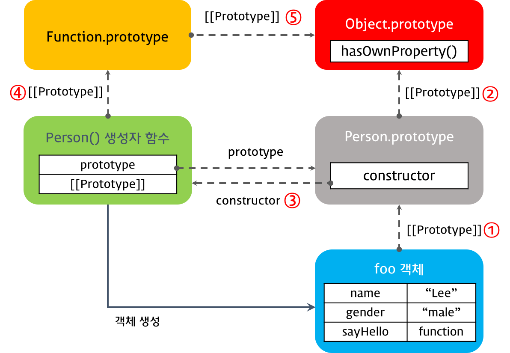
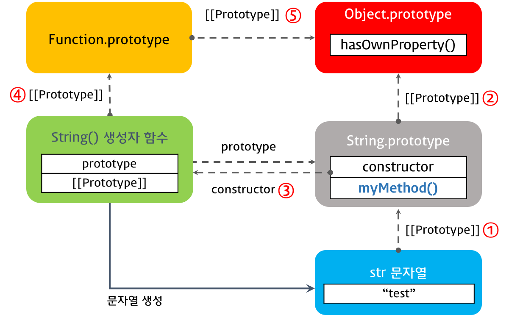
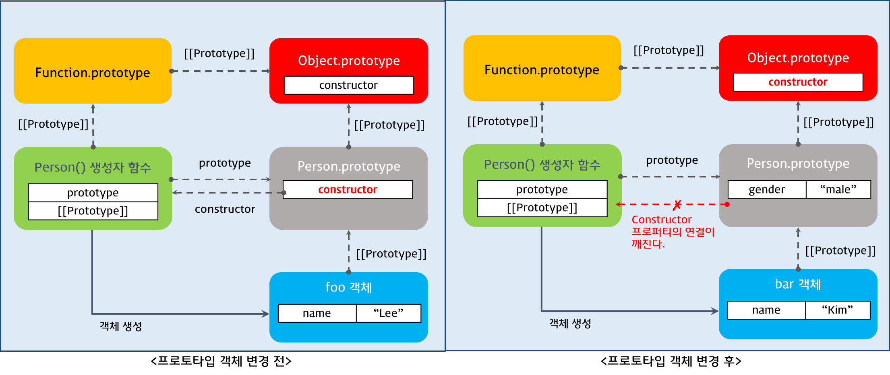

170801

# Javascript prototype

```javascript
function Person(name) {
  this.name = name;
  this.sayHello = function(){
    console.log(this.name);
  }
}

var foo = new Person('Lee');

```
foo의 property는 name, sayHello를 가진다. name은 primitive(기본값이라서) = Lee가 존재하며 sayHello는 객체라서 참조가 되는것(참조값 func이 존재만한다)이지 바로저장되지는 않는다.
foo가 친부를 찾을때는 foo.`__proto__`.costructor도 되지만 `foo.constructor(표준)`를 사용하면 프로토타입 체이닝에 의해서 Person.prototype의 property를 사용하여서 Person() 생성자 함수를 찾을 수 있다. 

> `함수는 일반 객체와 달리 prototype이라는 property를 가지는데 자신이 생성한 객체의 아버지를 가르킨다.`

## 1. 프로토타입 객체

- 자바스크립트의 모든 객체는 부모가 존재한다.
- `Prototype 기반 객체로` 나타낸다.

```javascript
var student = {
  name: 'Lee',
  score: 90
};

// student에는 hasOwnProperty 메서드가 없지만 아래 구문은 동작한다.
console.log(student.hasOwnProperty('name')); // true

console.dir(student); // student의 dir을 본다.
```

> hasOwnProperty는 obejct 객체안에 존재하기에 사용가능하다.

- 함수가 아니여서 prototype이 존재하지 않는다.
- `__proto__` 와 [[Prototype]]은 같은 개념이다.


`student.__proto__ === Object.prototype` // true이다.

## 2. [[Prototype]] 프로퍼티 vs prototype 프로퍼티
- [[Prototype]] 프러퍼티는 자신의 프로토타입 객체를 가리키는 숨겨진 프로퍼티이다.
- [[Prototype]] 프로퍼티는 `__proto__` 프로퍼티로 구현되어 있어 `__proto__과 [[Prototype]]은 같은 개념이다.`
- 함수도 객체이므로 [[Prototype]] 프로퍼티를 갖는다. 그런데 함수 객체는 일반 객체와는 달리 `prototype 프로퍼티도 소유하게 된다.`
- 함수객체는 일반객체와 달리 `호출`할 수 있다.

>  prototype 프로퍼티는 함수를 생성하는 생성자가 가르키는 것을 나타내고 [[Prototype]] 프로퍼티는 생성자로 생성한 함수가 가르키는것을 나타낸다 모두 프로토타입 객체를 가리키지만 관점의 차이가 있다.

```javascript
function Person(name) {
  this.name = name;
}

var foo = new Person('Lee');

console.dir(Person); // prototype 프로퍼티가 있다. / Person.prototype이 존재한다.
console.dir(foo);    // prototype 프로퍼티가 없다.
```

- [[Prototype]]프로퍼티
  - 함수를 포함한 모든 객체가 가지고 있는 프로퍼티이다.
  - `객체의 입장에서 자신의 양부 역할을 하는 프로토타입 객체을 가리키며 함수 객체의 경우 Function.prototype를 가리킨다.`
  
  ```javascript
  console.log(Person.__proto__ === Function.prototype);
  // Person의 부모는 Function.prototype이다. Funtion이라는 생성자가 존재한다.
  // Function 생성자함수는 Person의 친부모이다. Function.prototype의 __proto__는 Object.prototype이다.
  ```

- prototype 프로퍼티
  - 함수 객체만 가지고 있는 프로퍼티이다.
  - 함수 객체가 생성자로 사용될 때 이 함수를 통해 생성될 객체의 부모 역할을 하는 객체(프로토타입 객체)를 가리킨다

  ```javascript
  console.log(Person.prototype === foo.__proto__);
  ```
## 3. constructor 프로퍼티
- 프로토타입 객체는 constructor 프로퍼티를 갖는다.
- constructor 프로퍼티는 생성된 함수의 입장에서 생성자 함수를 찾아가기 위한 프로퍼티이다.

```javascript
function Person(name) {
  this.name = name;
}

var foo = new Person('Lee');

// Person() 생성자 함수에 의해 생성된 객체를 생성한 객체는 Person() 생성자 함수이다.
console.log(Person.prototype.constructor === Person);

// foo 객체를 생성한 객체는 Person() 생성자 함수이다. prototype chaining이다.
console.log(foo.constructor === Person);

// Person() 생성자 함수를 생성한 객체는 Function() 생성자 함수이다.
console.log(Person.constructor === Function);
```

## 4. Prototype chain
- 해당객체의 property가 있는지 여부를 찾고 없으면 __proto__를 찾아서 부모에 있는지 살핀다. 이것이 프로토타입 객체 상속의 핵심이다.


### 4.1 객체 리터럴 방식으로 생성된 객체의 프로토타입 체인
- 객체 생성 방법은 3가지이다.
  - 객체 리터럴
  - 생성자 함수 -> 생성자.prototype으로 생성된다.
  - Object() 생성자 함수  -> 객체 리터럴로 생성하면 내부적으로 Object 생성자 함수로 객체가 생성된다. Object.prototype으로 생성된다.

- 함수 객체인 Object() 생성자 함수는 일반 객체와 달리 prototype 프로퍼티가 있다.
```javascript
var person = {
  name: 'Lee',
  gender: 'male',
  sayHello: function(){
    console.log('Hi! my name is ' + this.name);
  }
};

console.dir(person);

console.log(person.__proto__ === Object.prototype);   // ① true
console.log(Object.prototype.constructor === Object); // ② true
console.log(Object.__proto__ === Function.prototype); // ③ true
console.log(Function.prototype.__proto__ === Object.prototype); // ④ true

```

;

> 결론적으로 객체 리터럴을 사용하여 객체를 생성한 경우 Object생성자로 객체를 생성한다.  그래서 객체의 프로토타입 객체는 Object.prototype이다.

### 4.2 생성자 함수로 생성된 객체의 프로토타입 체인
- 생성자 함수로 객체를 생성하기 위해서는 우선 생성자 함수를 정의하여야 한다.
- 함수를 정의하는 방식은 3가지 있다.
  - 함수선언식
  - 함수표현식
  - Function() 생성자 -> 결론적으로 이걸로 내부에 생성된다.

```javascript
function Person(name, gender) {
  this.name = name;
  this.gender = gender;
  this.sayHello = function(){
    console.log('Hi! my name is ' + this.name);
  };
}

var foo = new Person('Lee', 'male');

console.dir(Person);
console.dir(foo);

console.log(foo.__proto__ === Person.prototype);                // ① true
console.log(Person.prototype.__proto__ === Object.prototype);   // ② true
console.log(Person.prototype.constructor === Person);           // ③ true
console.log(Person.__proto__ === Function.prototype);           // ④ true
console.log(Function.prototype.__proto__ === Object.prototype); // ⑤ true
```

> 생성자 함수에는 method 만들지말고 생성자.prototype에다가 method를 만들어라.
불필요한 중복을 줄이기 위해서 이다.



- `Obejct.prototype객체를 프로토타입 체인의 종점이라고 한다.`

## 5. 프로토타입 객체의 확장
- 프로토타입 객체도 객체이므로 프로퍼티를 추가/삭제할 수 있다.

```javascript
function Person(name) {
  this.name = name;
}

var foo = new Person('Lee');

Person.prototype.sayHello = function(){
  console.log('Hi! my name is ' + this.name);
};  // foo 객체를 생성한 이후에 함수를 추가해도 되고 전에 써도 된다.

foo.sayHello();

```
> Person.prototype은 생성자 함수를 생성할때 즉 new를 사용할때 생성된다.


## 6. 기본자료형(Primitive data type)의 확장
- 자바스크립트에서 기본자료형(숫자, 문자열, boolean, null, undefined)을 제외한 모든것은 객체이다. 

```javascript
var str = 'test';  // 리터럴 방식
console.log(typeof str);                 // string
console.log(str.constructor === String); // true
console.dir(str);

var strObj = new String('test');  // 객체형으로 생성
console.log(typeof strObj);                 // object
console.log(strObj.constructor === String); // true
console.dir(strObj);

console.log(str.toUpperCase());    // TEST
console.log(strObj.toUpperCase()); // TEST
```
- 기본자료형은 상속개념이 없지만 객체는 상속개념이 있다.
- console.log(`strObj.constructor === String`); 를하면 기본자료형을 순간적으로 객체형으로 바꿔줬다가 다시 기본자료형으로 돌아온다.
  - 그래서 str.toUpperCase()를 사용할 수 있다. 
  - String, Number은 이방식을 사용할 때가 있다.
- `기본자료형으로 프로퍼티나 메소드를 호출할 때 기본자료형과 연관된 객체로 일시적으로 변환되어 프로토타입 객체를 공유하게 된다.`
  - 기본자료형은 객체가 아니므로 프로퍼티나 메소드를 직접 추가할 수 없다.(에러발생은 않는다.) -> 해결책 : `직접하면된다 String.prototype.myMethod`
  - 값을 공유함으로써 효율적인 메모리 사용이 가능해진다.

```javascript
var str = 'test';

String.prototype.myMethod = function () { // 이것을 통해서 직접추가가능 단 조심해야한다.
  return 'myMethod';
};

console.log(str.myMethod());      // myMethod
console.log('string'.myMethod()); // myMethod
console.dir(String.prototype);

```
- 표준이 아닌곳에 추가를 하기 때문에 옳은 방법은 아니다. 따로 모아서 만드는 것이 좋다.
  - myLibrary라는 객체를 만들어서 사용하는 것이 좋다.




## 7. 프로토타입 객체의 변경
- 상속을 변경하고 싶을 경우 사용한다.
  - 프로토타입 객체 변경 시점 이전에 생성된 객체
기존 프로토타입 객체를 [[Prototype]] 프로퍼티에 바인딩한다.
  - 프로토타입 객체 변경 시점 이후에 생성된 객체
변경된 프로토타입 객체를 [[Prototype]] 프로퍼티에 바인딩한다.

```javascript
function Person(name) {
  this.name = name;
}

var foo = new Person('Lee');

// 프로토타입 객체의 변경
Person.prototype = { gender: 'male' };

var bar = new Person('Kim');

console.log(foo.gender); // undefined
console.log(bar.gender); // 'male'

console.log(foo.constructor); // ① Person(name)
console.log(bar.constructor); // ② Object()

```
- 프로토타입 객체 변경 후 `constructor가 깨지기 때문에 이렇게는 하지않는다.`
- prototype에 method가 아닌 객체의 변경이 이루어져서 깨진다.



Q. 프로토타입 객체 변경 전 : foo.constructor가 Person(name)을 가르킨다는게 무슨이야기인지 모르겠습니다. Person.prototype.constructor가 Person() 생성자 함수아닌가요??

A. foo.constructor은 foo가 양부의 property를 사용하기에 가르킬수 있다.

## 8. 프로토타입 체인 동작 조건
- 객체의 프로퍼티를 참조하는 경우, 해당 객체에 프로퍼티가 없는 경우, 프로포타입 체인이 동작한다.

```javascript
function Person(name) {
  this.name = name;
}

Person.prototype.gender = 'male'; // ①

var foo = new Person('Lee');
var bar = new Person('Kim');

console.log(foo.gender); // ① 'male'
console.log(bar.gender); // ① 'male'

// 1. foo 객체에 gender 프로퍼티가 없으면 프로퍼티 동적 추가
// 2. foo 객체에 gender 프로퍼티가 있으면 해당 프로퍼티에 값 할당
foo.gender = 'female';   // ②

console.log(foo.gender); // ② 'female'
console.log(bar.gender); // ① 'male'
```