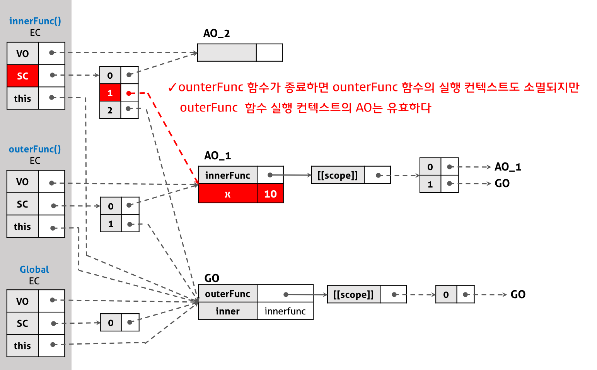

170807

# Js Closure

## 1. 클로저의 개념
- 클로저는 자바스크립트 고유의 개념이 아니라 함수를 일급 객체로 취급하는 함수형 언어(Functional language: Python, Haskell, Erlang, Perl, D, R…)에서 사용되는 중요한 특성이다.
- 클로저는 내부함수를 위한 외부함수의 지역변수가 외부함수에 의해 내부함수가 반환된 이후에도 life-cycle이 유지되는 것을 의미한다.

```javascript
function outerFunc() {
  var x = 10;
  var innerFunc = function () { console.log(x); };
  innerFunc();
}

outerFunc();
```
- 중첩된 함수의 scope 레퍼런스를 차례대로 저장하고 있는 Scope-chain을 자바스크립트 엔진이 검색하였기에 가능한 것이다
  - 1.innerFunc 함수 내에서 변수 x를 검색한다. 검색이 실패하였다.
  - 2.innerFunc 함수를 포함하는 외부 함수 outerFunc에서 변수 x를 검색한다. 검색이 성공하였다.

```javascript
function outerFunc() {
  var x = 10;
  var innerFunc = function () { console.log(x); };
  return innerFunc;
}

var inner = outerFunc(); // 클로저의 형성
inner(); // 10
```
- 클로저란? 위의 예제는 자신을 포함하고 있는 외부함수보다 내부함수가 더 오래 유지되는 경우인데 이때 내부함수가 외부함수의 지역변수에 접근 할 수 있고, 외부함수는 외부함수의 지역변수를 사용하는 내부함수가 소멸될 때까지 소멸되지 못하고 상태가 유지되며 내부함수에 의해서 소멸하게 되는 특성을 나타낸다.

- 클로저에 의해 참조되는 외부함수의 변수 즉 outerFunc 함수의 변수 x를 `자유변수(Free variable)`라고 부른다. 클로저라는 이름은 자유변수에 함수가 닫혀있다(closed)라는 의미로 의역하면 자유변수에 엮여있는 함수라는 뜻이다.

- 실행 컨텍스트의 관점에 설명하면, 내부함수가 유효한 상태에서 외부함수가 종료하여 외부함수의 실행 컨텍스트가 반환되어도, 외부함수 실행 컨텍스트 내의 `Activation object`(변수, 함수정의 등의 정보를 가지고 있다)는 유효하여 내부함수가 `Scope-chain`을 통해 참조할 수 있는 것을 의미한다.

  - 실행 컨텍스트의 Activation object와 클로저
  

## 2. 클로저의 활용
- 클로저는 자바스크립트의 강력한 기능이기는 하나 성능적인 면과 자원적인 면에서 손해를 볼 수 있다. 

### 2.1 전역 변수의 사용 억제
- 클로저의 필요성을 이해하기 위해서, 버튼이 클릭될 때마다 클릭한 횟수가 누적되어 화면에 표시되는 코드를 만들어보자.

```html
<!DOCTYPE html>
<html>
<body>
  <p>전역 변수를 사용한 Counting</p>

  <button type="button" onclick="myFunction()">Count!</button>

  <p id="demo">0</p>

  <script>
    var counter = 0;

    function add() {
      return counter += 1;
    }

    function myFunction(){
      document.getElementById('demo').innerHTML = add();
    }
  </script>
</body>
</html>
```
- 위 코드는 잘 동작한다. `하지만 add 함수만을 위한 전역 변수 counter를 사용하고 있다.` 전역 변수는 누구나 접근할 수 있어 의도하지 않게 변수명이 중복되거나 값이 변경되었을 때 문제가 될 수 있다. 그럼 전역 변수 counter를 add 함수의 지역 변수로 바꾸어보자.

```html
<!DOCTYPE html>
<html>
<body>
  <p>지역 변수를 사용한 Counting</p>

  <button type="button" onclick="myFunction()">Count!</button>

  <p id="demo">0</p>

  <script>
    function add() {
      var counter = 0;
      return counter += 1;
    }

    function myFunction(){
      document.getElementById('demo').innerHTML = add();
    }
  </script>
  </body>
</html>
```
- 클로저를 통한 문제해결코드

```html
<!DOCTYPE html>
<html>
  <body>
  <p>클로저를 사용한 Counting</p>

  <button type="button" onclick="myFunction()">Count!</button>

  <p id="demo">0</p>

  <script>
    var add = (function () {
      var counter = 0;
      return function () {
        return counter += 1;
      }
    })();

    function myFunction(){
      document.getElementById('demo').innerHTML = add();
    }
  </script>
  </body>
</html>
```
- 변수 add에는 즉시실행함수(immediately-invoked function expression)가 호출되어 그 결과 무명함수 function () {return counter += 1;}반환된다.
- 즉시실행함수는 한번만 실행되므로 add에 담겨있는 함수가 호출될 때마다 변수 counter가 재차 초기화될 일은 없을 것이다

-  `중요한 것은 add에 담겨있는 함수는 변수 counter에 접근할 수 있고 변수 counter는 add에 담겨있는 함수가 소멸될 때가지 유지된다는 것이다.` 이것이 바로 클로저이다.

- 변수 counter는 외부에서 직접 접근할 수 없는 private 변수이므로 전역 변수를 사용했을 때와 같이 의도되지 않은 변경을 걱정할 필요도 없다.

### 2.2 setTimeout()의 콜백 함수
- setTimeout() 함수는 첫번째 parameter에 콜백 함수를 전달하고, 두번째 parameter에 시간 간격(ms: 1000분의 1초)을 지정한다. 즉 지정된 시간 간격으로 콜백 함수를 호출한다.

```html
<!DOCTYPE html>
<html>
<body>
  <p>새로고침으로 다시 실행해 보세요</p>
  <script>
    var fade = function (node) {
      // 자유변수
      var level = 1; // ②
      var step = function() {
        var hex = level.toString(16); // ④
        
        // hex: '1' ~ 'f'
        node.style.backgroundColor = '#ff' + hex; // ⑤

        if(level < 15) { // ⑥
          level += 1;
          setTimeout(step, 100); // ⑦
        }
      };
      // setTimeout 호출 이후 fade 함수는 종료한다. 100ms 후 함수 step은 호출된다.
      // 즉 외부 함수 fade보다 내부 함수 step이 더 오래 유지된다.
      setTimeout(step, 100); // ③
    };

    fade(document.body); // ①
  </script>
</body>
</html>

```

① 함수 fade는 document.body를 인자로 전달받아 호출된다.  

② 함수 fade의 지역변수 level은 1로 초기화되어 있다. 함수 step은 내부함수이며 외부함수 fade의 지역변수 level을 사용한다. level은 자유변수이다.  

③ setTimeout 호출 이후 fade 함수는 종료한다. 100ms 후 함수 step은 호출된다. `즉 외부 함수 fade보다 내부 함수 step이 더 오래 유지된다.`  

④ 함수 step은 지역변수 hex을 갖는다. 이것은 16진수 문자열을 값으로 갖는다.   

⑤ 함수 fade의 매개변수 node(document.body)의 배경색을 변경한다.  

⑥ 변수 level이 15(f)보다 작은지 다시말해 16진수 범위 내(1~f)인지 확인한다.  

⑦ level을 1 증가시키고 다시 함수 step을 호출하여 같은 작업을 반복한다.  

### 2.3 자주 발생하는 실수

```javascript
var arr = [];

for (var i = 0; i < 5; i++) {
  arr[i] = function () {
    return i;
  };
}

for (var index = 0; index < arr.length; index++) {
  console.log(arr[index]());
}

```
- 배열 arr에 5개의 함수가 할당되고 각각의 함수는 순차적으로 0, 1, 2, 3, 4를 반환할 것으로 기대하겠지만 결과는 그렇지않다. `이유는 변수 i는 외부함수의 변수가 아닌 전역 변수이기 때문이다.` 바르게 동작하는 코드는 아래와 같다.

```javascript
var arr = [];

for (var i = 0; i < 5; i++){
  arr[i] = (function (id) { // ②
    return function () {
      return id; // ③
    };
  })(i); // ①
}

for (var index = 0; index < arr.length; index++) {
  console.log(arr[index]());
}
```
① 배열 arr에는 즉시실행함수에 의해 함수가 반환된다.

② 이때 즉시실행함수는 i를 인자로 전달받고 매개변수 id에 할당한 후 내부 함수를 반환하고 life-cycle이 종료된다. 매개변수 id는 자유변수가 된다.

③ 배열 arr에 할당된 함수는 id를 반환한다. 이때 id는 상위 스코프의 자유변수이므로 그 값이 유지된다.

- 
위 예제는 자바스크립트의 함수 레벨 스코프 특성으로 인해 for 루프의 초기문에서 사용된 변수의 스코프가 전역이 되기 때문에 발생하는 현상이다. ES6의 `let 키워드`를 사용하면 이와 같은 문제는 말끔히 해결된다.

```javascript
const arr = [];

for (let i = 0; i < 5; i++) {
  arr[i] = function () {
    return i;
  };
}

for (let i = 0; i < arr.length; i++) {
  console.log(arr[i]());
}
```