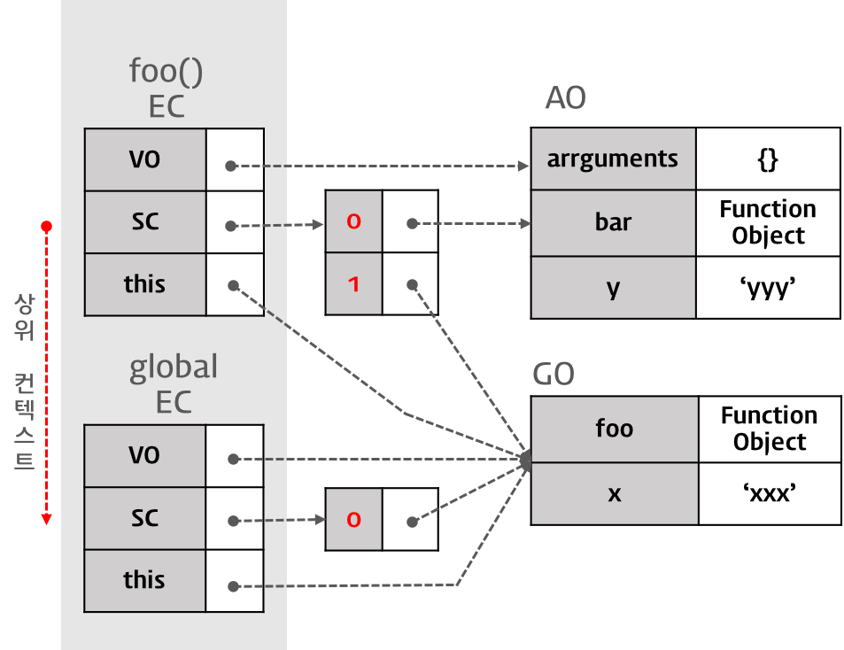
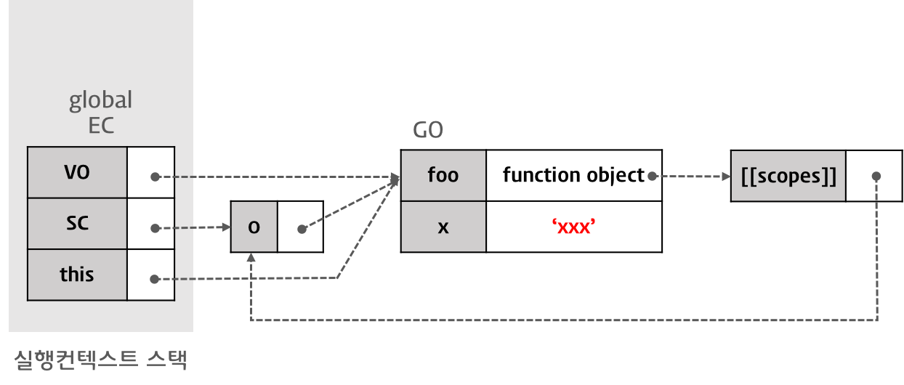
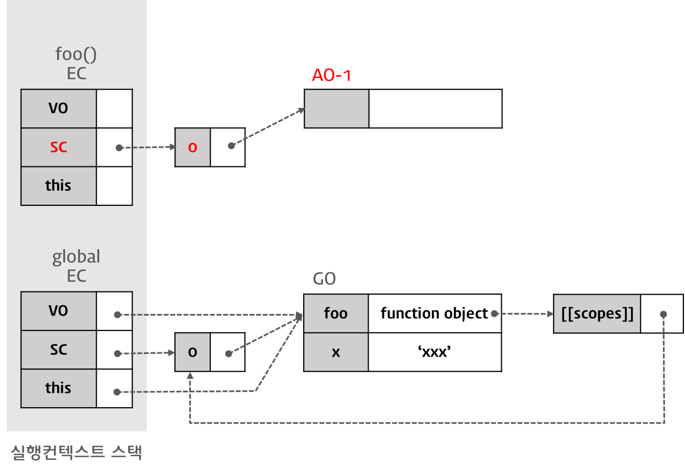
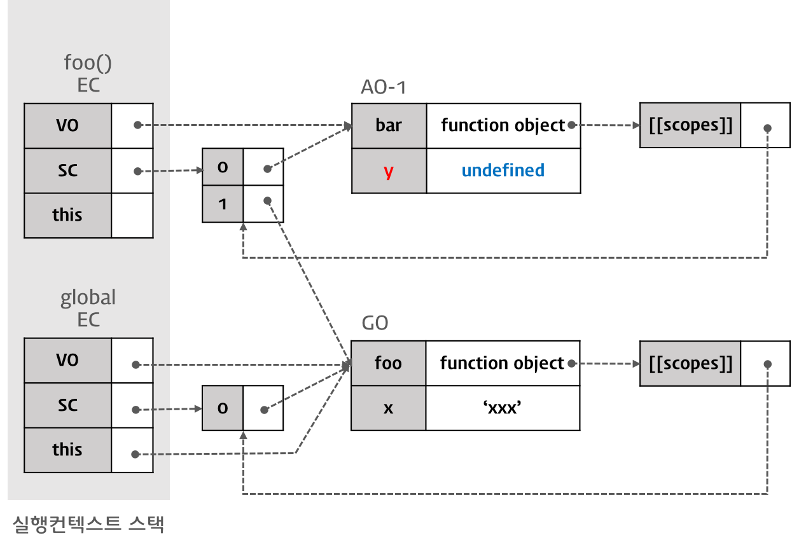

170807

# Js Excution Context


## 1. 실행 컨텍스트
- `실행 컨텍스트는 실행 가능한 코드 블럭이 실행되는 환경`이라고 말할수 있다.
  - Global Code : 전역 영역에 존재하는 코드
  - Eval Code : Eval 함수로 실행되는 코드
  - Function Code : 함수 내에 존재하는 코드
- 실행 컨텍스트 : 실행에 필요한 여러가지 정보(실행 환경)를 관리하기 위한 객체
  - 실행에 필요한 정보
    - 변수 : 함수 내부에서만 접근할 수 있는 지역변수, 메소드에서 this를 통해 접근할 수 있는 객체의 프로퍼티
  - 매개변수(parameter)
  - 함수 선언
  - 변수의 유효범위(Scope)
  - this

```javascript
var x = 'xxx';

function foo () {
  var y = 'yyy';

  function bar () {
    var z = 'zzz';
    console.log(x + y + z);
  }
  bar();
}
foo();

```
- `global 변수`는 Data영역에 저장이된다.
- `local 변수` stack영역에 저장되며 호출이 끝나면 사라진다.(함수와 다르다.)
  - 컨트롤이 실행 가능한 코드로 이동하면 논리적 스택(Stack) 구조를 가지는 새로운 실행 컨텍스트 스택이 생성된다. 스택은 LIFO(Last In First Out, 후입 선출)의 구조를 가지는 나열 구조이다.
  - Global code(전역 코드)로 컨트롤이 들어가면 전역 실행 컨텍스트가 실행 컨텍스트 스택에 쌓인다. 전역 실행 컨텍스트는 애플리케이션이 종료될 때(웹 페이지에서 나가거나 브라우저를 닫을 때)까지 유지된다.
  - 함수를 호출하면 해당 함수의 실행 컨택스트가 생성되며 직전에 실행된 코드블럭의 실행 컨텍스트 위에 쌓인다.
  - 함수 실행이 끝나면 해당 함수의 실행 컨텍스트를 파기하고 직전의 실행 컨텍스트에 컨트롤을 반환한다.


## 2. 실행 컨텍스트 객체의 프로퍼티
- 실행 컨텍스트(Excution context)는 객체이며 아래의 3가지 프로퍼티를 소유한다.
  - Variable object : {vars, function declarations, arguments}
  - Scope chain : [Variable object + all parent scopes]
  - thisValue : Context object

### 2.1 Variable Object (VO / 변수객체)
- Variable Object(VO/변수 객체) : 실행 컨텍스트가 생성되면 자바스크립트 엔진은 실행에 필요한 여러 정보들을 담을 객체
  - Variable Object는 코드가 실행될 때 엔진에 의해 참조되며 코드에서는 접근할 수 없다.
- Variable Object의 정보
  - 변수 
  - 매개변수(parameter)와 인수(argument),
  - 함수 선언(함수 표현식은 제외)
- Variable Object가 가리키는 객체는 아래와 같다.

> 전역 컨텍스트의 경우
Variable Object는 유일하며 최상위에 위치하고 모든 전역 변수, 전역 함수 등을 포함하는 `전역 객체(GO)`를 가리킨다. 전역 객체는 전역에 선언된 전역 변수와 전역 함수를 프로퍼티로 소유한다.


> 함수 컨텍스트의 경우
Variable Object는 `Activation Object(AO / 활성 객체)`를 가리키며 매개변수와 인수들의 정보를 배열의 형태로 담고 있는 객체인 arguments object가 추가된다.


Q. 여기서 bar는 funxtion foo(){ bar(); }를 나타내는건가요?

### 2.2 Scope Chain(SC)
- Scope Chain은 일종의 리스트로서 중첩된 함수의 스코프의 레퍼런스를 차례로 저장하고 있는 개념이다.
-  Scope Chain는 현재 실행 컨텍스트의 Activation Object를 선두로하여 순차적으로 상위 컨텍스트의 Activation Object를 가리키며 마지막 리스트는 전역 객체를 가리킨다.
- 함수 내의 코드에서 변수를 참조하면 엔진은 Scope Chain의 첫번째 리스트가 가리키는 AO에 접근하여 변수를 검색한다. 만일 검색에 실패하면 다음 리스트가 가리키는 Activation Object(또는 전역 객체)를 검색한다. 이와 같이 순차적으로 Scope Chain에서 변수를 검색하는데 결국 검색에 실패하면 정의되지 않은 변수에 접근하는 것으로 판단하여 Reference 에러를 발생시킨다. 스코프 체인은 `[[scope]]` 프로퍼티로 참조할 수 있다.

- Q. 1은 상위 scope를 가리키는건가요?
- 왜 global에서는 화살표가 가운데로가나요??

### 2.3 this value
- this 프로퍼티에는 this 값이 할당된다. this에 할당되는 값은 함수 호출 패턴에 의해 결정된다.

## 3. 실행 컨텍스트의 생성 과정

```javascript
var x = 'xxx';

function foo () {
  var y = 'yyy';

  function bar () {
    var z = 'zzz';
    console.log(x + y + z);
  }
  bar();
}

foo();

```

### 3.1 Global Code에의 진입
- 컨트롤이 실행 컨텍스트에 들어가기 이전에 유일한 전역 객체(Global Object)가 생성된다.
- 코드가 종료되면 전역 객체의 라이프 사이클은 끝이 난다.
- 코드의 어떠한 곳에서도 접근할 수 있다.
- 초기상태의 전역 객체에는 Built-in object(Math, String, Array 등)와 BOM, DOM이 Set 되어있다.  
  - 초기상태의 실행 컨텍스트


- 전역 객체가 생성된 이후, Global Code로 컨트롤이 이동하면 새로운 전역 실행 컨텍스트가 스택에 쌓인다.  
  - 전역 실행 컨텍스트의 생성  


- 그리고 이후 이 실행 컨텍스트를 바탕으로 이하의 처리가 실행된다.
  - Scope Chain의 생성과 초기화
  - Variable Instantiation 실행
  - this value 결정

#### 3.1.1 Scope Chain의 생성과 초기화
- 새로운 실행 컨텍스트에 들어가게 되면 우선 Scope Chain의 생성과 초기화가 실행된다. Global Code로 컨트롤이 이동하면 Scope Chain는 전역 객체의 레퍼런스를 포함하는 리스트가 된다.  

  - Scope Chain의 생성과 초기화

> Scope Chain에다가 `0`을 추가한다.

#### 3.1.2 Variable Instantiation(변수 객체화) 실행
- Scope Chain의 생성과 초기화가 끝나면 Variable Instantiation이 실행된다.
  - Variable Instantiation은 Variable Object에 프로퍼티와 값을 추가하는 것을 의미한다.(변수 객체화)
- Global Code의 경우, Variable Object는 Global Object를 가리킨다.
  - Variable Instantiation(변수 객체화): `VO와 GO의 연결`


- Variable Instantiation  (변수 객체화)는 아래의 순서로 Variable Object에 프로퍼티와 값을 set한다. (`반드시 1→2→3 순서로 실행된다.`)

  - (Function Code인 경우) 매개변수(parameter)가 Variable Object의 프로퍼티로, 인수(argument)가 값으로 set된다.
  - 대상 코드 내의 함수 선언(함수 표현식 제외)을 대상으로 함수명이 Variable Object의 프로퍼티로, 생성된 Function Object가 값으로 set된다.(함수 호이스팅)
  - 대상 코드 내의 변수 선언을 대상으로 변수명이 Variable Object의 프로퍼티로, undefined가 값으로 set된다.(변수 호이스팅)

- 우선 2. 함수 foo의 선언이 처리되고(Function Code이 아닌 Global Code이기 때문에 1. 매개변수 처리는 실행되지 않는다.) 그 후 3. 변수 x의 선언이 처리된다.

#### 3.1.2.1 함수 foo의 선언 처리
- 함수 선언은 Variable Instantiation 실행 순서 2.와 같이 선언된 함수명( foo )이 Variable Object( Global Code인 경우 Global Object )의 프로퍼티로, 생성된 Function Object가 값으로 바인딩된다.
  - 함수 foo의 선언 처리

- 생성된 Function Object는 `[[Scopes]]` 프로퍼티를 가지게 된다. [[Scopes]] 프로퍼티는 값으로 현재 실행 컨텍스트의 Scope Chain이 참조하고 있는 객체와 같은 객체를 참조하는 리스트가 바인딩된다.

> 참조하는 값이 없이 최상위 이므로 0을 가지게된다.

> `함수 호이스팅`: 스코프 체인이 가리키는 변수 객체에 이미 함수가 등록되어 있으므로 이후 코드를 실행할 때 함수선언식 이전에 함수를 호출할 수 있게 되었다. 

#### 3.1.2.2 변수 x의 선언 처리
- 변수 선언은 Variable Instantiation 실행 순서 3.과 같이 선언된 변수명( x )이 Variable Object의 프로퍼티로, undefined가 값으로 set된다.
  - `선언 단계(Declaration phase)`
변수 객체(Variable Object)에 변수를 등록한다. 이 변수 객체는 스코프가 참조할 수 있는 대상이 된다.
  - `초기화 단계(Initialization phase)`
변수 객체(Variable Object)에 등록된 변수를 메모리에 할당한다. 이 단계에서 변수는 undefined로 초기화된다.
  - `할당 단계(Assignment phase)`
undefined로 초기화된 변수에 실제값을 할당한다.

- `var 키워드로 선언된 변수는 선언 단계와 초기화 단계가 한번에 이루어진다. `

>`변수 호이스팅`: 변수 선언문 이전에 변수에 접근하여도 Variable Object에 변수가 존재하기 때문에 에러가 발생하지 않는다. 다만 undefined를 반환한다. 
  -  변수 x의 선언 처리


#### 3.1.3 this value 결정
- 변수 선언 처리가 끝나면 다음은 this value가 결정된다. this에 할당되는 값은 함수 호출 패턴에 의해 결정된다.
- Global Code의 경우, this의 value는 언제나 전역 객체이다.

  -  this value 결정


- `전역 컨텍스트(Global Code)의 경우, Variable Object, Scope Chain, this값은 언제나 전역 객체이다.`

### 3.2 Global code의 실행

```javascript
var x = 'xxx';

function foo () {
  var y = 'yyy';

  function bar () {
    var z = 'zzz';
    console.log(x + y + z);
  }
  bar();
}

foo();

```

#### 3.2.1 변수 값의 할당
- 현재 실행 컨텍스트의 Scope Chain이 참조하고 있는 Variable Object를 선두(0)부터 검색하여 변수명에 해당하는 프로퍼티가 발견되면 값(‘xxx’)을 할당한다.
  - 변수 값의 할당


#### 3.2.2 함수 foo의 실행
- Global Code의 함수 foo가 실행되기 시작하면 새로운 함수 실행 컨텍스트가 생성된다. 
- 함수 foo의 실행 컨텍스트로 컨트롤이 이동하면 Global Code의 경우와 마찬가지로  `1. Scope Chain의 생성과 초기화, 2. Variable Instantiation 실행, 3. this value 결정이 순차적으로 실행된다.`

- Global Code와 다른 점은 이번 실행되는 코드는 Function Code이라는 것이다. 
  - 함수 foo의 실행 컨텍스트 생성


#### 3.2.2.1 Scope Chain의 생성과 초기화
- Function Code의 `Scope Chain의 생성과 초기화`는 우선 Activation Object에 대한 레퍼런스를 Scope Chain의 선두에 바인딩하는 것으로 시작된다.
- Activation Object는 스펙 상의 개념으로 프로그램이 Activation Object에 직접 접근할 수 없다. (Activation Object의 프로퍼티로의 접근은 가능하다)
  - Scope Chain의 생성과 초기화: Activation Object의 생성과 바인딩
    
- Caller(global context)의 [[Scope]] 프로퍼티가 참조하고 있는 객체가 Scope Chain에 push된다.
- 함수 foo를 실행한 직후 실행 컨텍스트의 Scope Chain은 Activation Object(함수 foo의 실행으로 만들어진 AO-1)과 Global Object를 순차적으로 참조하게 된다.
  - Scope Chain의 생성과 초기화: Caller의 [[Scope]]를 Scope Chain에 push
  ![Scope Chain의 생성과 초기화: Caller의 [[Scope]]를 Scope Chain에 push](../images/ec_13.png)  

#### 3.2.2.2 Variable Instantiation 실행
- Function Code의 경우, Scope Chain의 생성과 초기화에서 생성된 Activation Object를 Variable Object로서 Variable Instantiation가 실행된다. 
  - Variable Instantiation 실행: 함수 bar의 선언 처리
   

- 변수 y를 Variable Object(AO-1)에 set한다(프로퍼티는 y, 값은 undefined）
  - 변수 y를 Variable Object(AO-1)에 set한다(프로퍼티는 y, 값은 undefined）
  


#### 3.2.2.3 this value 결정
- 변수 선언 처리가 끝나면 다음은 this value가 결정된다. this에 할당되는 값은 함수 호출 패턴에 의해 결정된다.
- `내부 함수의 경우, this의 value는 전역 객체이다.`
  - this value 결정
    

### 3.3 foo function code의 실행
- 이제 함수 foo의 코드블럭 내 구문이 실행된다. 위 예제를 보면 변수 y에 문자열 ‘yyy’의 할당과 함수 bar가 실행된다.

#### 3.3.1 변수 값의 할당
- 지역 변수 y에 문자열 ‘yyy’를 할당할 때, 현재 실행 컨텍스트의 Scope Chain이 참조하고 있는 Variable Object를 선두(0)부터 검색하여 변수명에 해당하는 프로퍼티가 발견되면 값 ‘yyy’를 할당한다.
  - 변수 y에의 값 할당
   

#### 함수 bar의 실행
- 함수 bar가 실행되기 시작하면 새로운 실행 컨텍스트이 생성된다.
  - 함수 bar의 실행
  

- 이전 함수 foo의 실행 과정과 동일하게 1. Scope Chain의 생성과 초기화, 2. Variable Instantiation 실행, 3. this value 결정이 순차적으로 실행된다.
  - 완성된 실행 컨텍스트
  
- 이 단계에서 console.log(x + y + z); 구문의 실행 결과는 xxxyyyzzz가 된다.
  - x : AO-2에서 x 검색 실패 → AO-1에서 x 검색 실패 → GO에서 x 검색 성공 (값은 ‘xxx’)
  - y : AO-2에서 y 검색 실패 → AO-1에서 y 검색 성공 (값은 ‘yyy’)
  - z : AO-2에서 z 검색 성공 (값은 ‘zzz’)