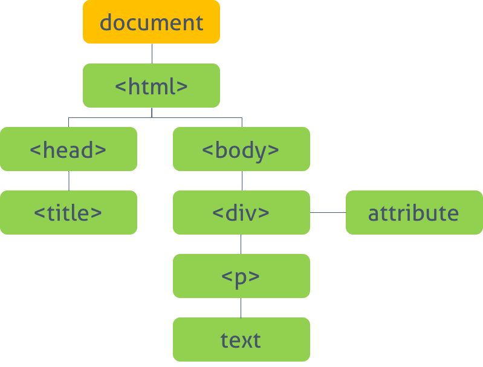

170808

# Js Built-in Object

`Built-in Object(내장 객체)는` 웹페이지 등을 표현하기 위한 공통의 기능을 제공한다.
  - Standard Built-in Objects (or Global Objects) 기본적으로 적용되어있는 객체들 (string, array 등등)
  - BOM (Browser Object Model) size, history 함수 등등
  - DOM (Document Object Model) render tree 등등

`Standard Built-in Objects(표준 빌트인 객체)를` 제외한 BOM과 DOM을 `Native Object`라고 분류하기도 한다. 또한 사용자가 생성한 객체를 `Host Object(사용자 정의 객체)`라 한다.

## 1. Standard Built-in Objects (or Global Objects)
- javascript가 제공하며 기본적으로 `대문자`로 시작한다.
- 전역 객체의 프로퍼티이다.

> Global Object는 전역객체를 뜻한다. Global Objects랑 의미가 다르다.

## 2. BOM (Browser Object Model)
- client side에서 최상위 객체는 `window이다.`
  -  BOM 객체  
  

- 자세한 내용은 [window 객체 참조](https://developer.mozilla.org/en-US/docs/Web/API/Window)를 참조하기 바란다.

## 3. DOM (Document Object Model)
- DOM은 browser가 만든다.
- 최상위 객체는 `document` 객체로 전체 문서를 표현한다.
  -  DOM 객체  
  