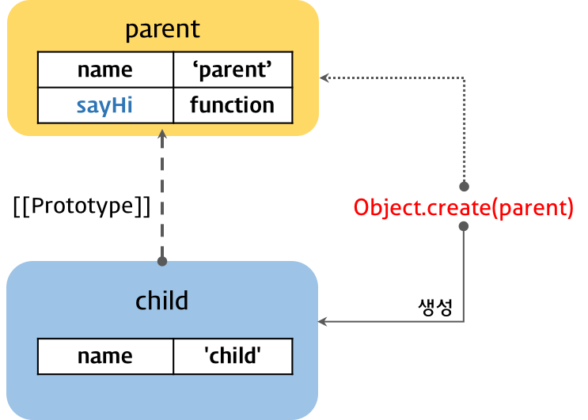
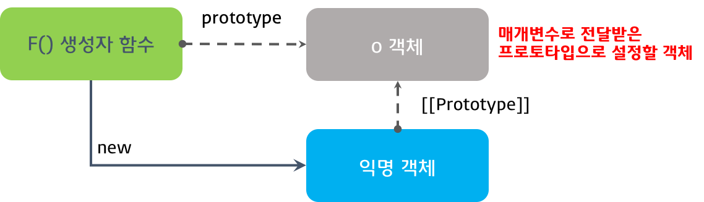

170808

# Js Object-Oriented Programming

## 1. 객체지향 프로그래밍(Object-Oriented Programming) 개요

- 객체지향형이란? `객체의 핵심적인 개념 또는 기능만을 추출하는 추상화(abstraction)를 통해` 모델링하려는 프로그래밍 패러다임을 말한다.  
  - 프로퍼티를 통해서 확인한다.  
- 객체는 데이터(멤버변수)와 행위(method)를 가지고 있다고 표현한다.  
- 사물을 인식할때 특성을 구분하고 그 특성에 값을 매긴것처럼 객체도 이렇게 만든다.  
- `상속`을 통하여 비교하려는 대상중 큰 대상에게 작은 대상을 포함시킨다.  
  - 동물에 사람이 포함된다.  
  - 상속은 유지보수 및 성능 향상에 도움이 된다.  
- `캡슐화`를 통해서 비공개를 할 정보를 감춘다.  
> this는 method, 생성자 함수에서만 사용하는 것이 좋다.

## 2. 클래스 기반 vs. 프로토타입 기반

### 2.1 클래스 기반 언어
- 클래스 기반언어는 클래스로 객체의 자료구조와 기능을 정의하고 생성자를 통해 인스턴스를 생성한다.
- 객체를 생성한 이후에 `프로퍼티를 변경할 수 없다`.

### 2.2 프로토타입 기반 언어
- 자바스크립트는 명령형(절차적), 함수형, 프로토타입 기반 객체지향 언어이다.
- 자바스크립트는 클래스 개념이 없고 별도의 객체 생성 방법이 존재한다.
  - 객체 리터럴
  - object() 생성자함수
  - 생성자 함수
- 객체를 생성한 이후에도 `프로퍼티를 변경할 수 있다`.
- 익숙한 클래스 기반의 언어를 사용할 수 없다.
- ES6로 클래스형으로 만들고 바벨이라는 것으로 ES5으로 변경하면된다.

```javascript
// 객체 리터럴
var obj1 = {};
obj1.name = 'Lee';

// Object() 생성자 함수
var obj2 = new Object();
obj2.name = 'Lee';

// 생성자 함수
function F() {}
var obj3 = new F();
obj3.name = 'Lee';
```

- 자바스크립트는 객체가 생성된 이후에 `인스턴스(프로퍼티)를 동적으로 변경할 수 있다.`

## 3. 생성자 함수와 인스턴스의 생성

```javascript
// 생성자 함수(Constructor)
function Person(name) {
  // 프로퍼티 => this는 생성자 함수가 생성하는 객체를 가리킨다.
  this.name = name;

  // 메소드
  this.setName = function (name) {
    this.name = name;
  };

  // 메소드
  this.getName = function () {
    return this.name;
  };
}

// 인스턴스의 생성
var me = new Person('Lee');
console.log(me.getName()); // Lee

// 메소드 호출
me.setName('Kim');
console.log(me.getName()); // Kim
```
- `이렇게 생성하면 안되고 메소드를 프로토타입에다가 생성해야한다.`

## 4. 프로토타입 체인과 메소드의 정의

```javascript
function Person(name) {
  this.name = name;
}

// 프로토타입 객체에 메소드 정의
Person.prototype.setName = function (name) {
  this.name = name;
};

// 프로토타입 객체에 메소드 정의
Person.prototype.getName = function () {
  return this.name;
};

var me  = new Person('Lee');
var you = new Person('Kim');
var him = new Person('choi');

console.log(Person.prototype); 
// Person { setName: [Function], getName: [Function] }

console.log(me);  // Person { name: 'Lee' }
console.log(you); // Person { name: 'Kim' }
console.log(him); // Person { name: 'choi' }

```
  - 프로포타입 체인과 메소드의 정의  


- Person.prototype위치에 새로운것을 같다가 바꿔보는것에 대해서 상속패턴이 나왔으며 상속패턴의 문제점은 밑에서 설명한다.

- 더글라스 크락포드가 제안한 프로토타입 객체에 메소드를 추가하는 방식이다.

```javascript
/**
 * 모든 생성자 함수의 프로토타입은 Function.prototype이다. 따라서 모든 생성자 함수는 Function.prototype.method()에 접근할 수 있다.
 * @method Function.prototype.method
 * @param ({string}) (name) - (메소드 이름)
 * @param ({function}) (func) - (추가할 메소드 본체)
 */
Function.prototype.method = function (name, func) {
  // 생성자함수의 프로토타입에 동일한 이름의 메소드가 없으면 생성자함수의 프로토타입에 메소드를 추가
  // this: 생성자함수
  if (!this.prototype[name]) {
    this.prototype[name] = func;
  }
};

/**
 * 생성자 함수
 */
function Person(name) {
  this.name = name;
}

/**
 * 생성자함수 Person의 프로토타입에 메소드 setName을 추가
 */
Person.method('setName', function (name) {
  this.name = name;
});

/**
 * 생성자함수 Person의 프로토타입에 메소드 getName을 추가
 */
Person.method('getName', function () {
  return this.name;
});

var me  = new Person('Lee');
var you = new Person('Kim');
var him = new Person('choi');

console.log(Person.prototype);
// Person { setName: [Function], getName: [Function] }

console.log(me);  // Person { name: 'Lee' }
console.log(you); // Person { name: 'Kim' }
console.log(him); // Person { name: 'choi' }

```

## 5. 상속(Inheritance)
- 이것은 프로토타입을 통해 객체가 다른 객체로 직접 상속된다는 의미이다.

### 5.1 의사 클래스 패턴 상속 (Pseudo-classical Inheritance) 
- `문제가 발생하여서 프로토타입 패턴 상속 (Prototypal Inheritance)을 사용한다.`
- 의사 클래스 패턴은 자식 생성자 함수의 prototype 프로퍼티를 부모 생성자 함수의 인스턴스로 교체하여 상속을 구현하는 방법이다.
- 부모와 자식 모두 생성자 함수를 정의하여야 한다.

```javascript
// 부모 생성자 함수
var Parent = (function () {
  // Constructor
  function Parent(name) {
    this.name = name;
  }

  // method
  Parent.prototype.sayHi = function () {
    console.log('Hi! ' + this.name);
  };

  // return constructor
  return Parent;
}());

// 자식 생성자 함수
var Child = (function () {
  // Constructor
  function Child(name) {
    this.name = name;
  }

  // 자식 생성자 함수의 프로토타입 객체를 부모 생성자 함수의 인스턴스로 교체.
  Child.prototype = new Parent(); // ②

  // 메소드 오버라이드
  Child.prototype.sayHi = function () {
    console.log('안녕하세요! ' + this.name);
  };

  // sayBye 메소드는 Parent 생성자함수의 인스턴스에 위치된다
  Child.prototype.sayBye = function () {
    console.log('안녕히가세요! ' + this.name);
  };

  // return constructor
  return Child;
}());

var child = new Child('child'); // ①
console.log(child);  // Parent { name: 'child' }

console.log(Child.prototype); // Parent { name: undefined, sayHi: [Function], sayBye: [Function] }

child.sayHi();  // 안녕하세요! child
child.sayBye(); // 안녕히가세요! child

console.log(child instanceof Parent); // true
console.log(child instanceof Child);  // true.log(child instanceof Parent); // true

```

#### 부작용 발생 3가지 

- 1.new 연산자를 통해 인스턴스를 생성한다.
- 2.생성자 링크의 파괴 child객체의 constructor가 Parent가 나온다.
  - why? new Parent()라서 prototype이 아니라서 consturctor가 없어서 Parent.prototype을 가서 실행하기 때문이다.
- 3.객체리터럴 객체 의사 클래스 패턴은 자체가 안된다.
  - why? object.prototype을 교체하면 전체가 영향을 받기때문에 변경할 수 없다.

> 즉시실행함수는 어떤값을 return하는지를 먼저 봐야한다.
  - 의사 클래스 패턴 상속


### 5.2 프로토타입 패턴 상속 (Prototypal Inheritance)
- 프로토타입 패턴 상속은 Object.create 함수를 사용하여 객체에서 다른 객체로 직접 상속을 구현하는 방식이다.
  - object.create(proto[, propertiesOnject]) => 부모로 지정할 것을 써준다.
    - `var child = Object.create(Parent.prototype);`
- 의사 클래스 패턴 상속의 부작용을 다 방지한다.

> 바벨로 만들어 줄 수 있다.

```javascript
// 부모 생성자 함수
var Parent = (function () {
  // Constructor
  function Parent(name) {
    this.name = name;
  }

  // method
  Parent.prototype.sayHi = function () {
    console.log('Hi! ' + this.name);
  };

  // return constructor
  return Parent;
}());

// create 함수의 인수는 프로토타입이다. 
var child = Object.create(Parent.prototype);
child.name = 'child';

child.sayHi();  // Hi! child

console.log(child instanceof Parent); // true
```
  - 프로토타입 패턴상속: 생성자 함수
  

- 객체리터럴 패턴으로 생성한 객체에도 프로토타입 패턴 상속을 사용할 수 있다.
  -  `var child = Object.create(parent);`

```javascript
var parent = {
  name: 'parent',
  sayHi: function() {
    console.log('Hi! ' + this.name);
  }
};

// create 함수의 인자는 객체이다. 
var child = Object.create(parent);
child.name = 'child';

// var child = Object.create(parent, {name: {value: 'child'}});

parent.sayHi(); // Hi! parent
child.sayHi();  // Hi! child

console.log(parent.isPrototypeOf(child)); // true
```

- 프로토타입 패턴상속: 객체 리터럴
  

- IE9이상에서만 Object.create명령어가 된다.
- 밑에 버전을 대응하기 위해서 방어코드를 통하여 만들어야한다.

```javascript
// Object.create 함수의 폴리필
if (!Object.create) {
  Object.create = function (o) {
    function F() {}  // 1  빈객체를 반환하는 생성자 함수
    F.prototype = o; // 2  생성자 함수가 생성할 객체의 prototype에 o를 넣는다.
    return new F();  // 3  
  };
}
```
- 위 폴리필은 프로토타입 패턴 상속의 핵심을 담고 있다.

  - 1.비어있는 생성자 함수 F를 생성한다.
  - 2.생성자 함수 F의 prototype 프로퍼티에 매개변수로 전달받은 객체를 할당한다.
  - 3.생성자 함수 F를 생성자로 하여 새로운 객채를 생성하고 반환한다.
 
  - Object.create 함수의 폴리필
 

 > 프레임워크를 사용해서 상속을 지정해주겠지만 기본적으로 javascript의 상속구조를 이해하기위해서 공부를 해야한다.

## 6. 캡슐화(Encapsulation)와 모듈 패턴(Module Pattern)
- 공개할 프로퍼티는 공개하고 비공개적인 프로퍼티를 감추기 위해서 캡슐화를한다.  
- this로 묶이면 기본적으로 public이며 var로 묶이면 private처럼 사용된다.

```javascript
var Person = function(arg) {
  var name = arg ? arg : ''; // ①

  this.getName = function() {
    return name;
  };

  this.setName = function(arg) {
    name = arg;
  };
}

var me = new Person('Lee');

var name = me.getName();

console.log(name);

me.setName('Kim');
name = me.getName();

console.log(name);
```

- 모듈 패턴 `클로저를 사용하여서 생성자함수가아닌 함수로 만들어낸다. 필요한 메소드만 담아서 return으로 넘긴다. 즉 공개하고 싶은것만 넘기고 아닌것은 외부함수가 위치한 곳에 작성한다.`

```javascript
var person = function(arg) {
  var name = arg ? arg : ''; // 외부함수

  return {  // 객체시작
    getName: function() {
      return name;
    },
    setName: function(arg) {
      name = arg;  // 내부함수 -> 내부함수가 외부함수보다 오래유지된다 클로저이다.
    }
  } // 객체 끝
}

var me = person('Lee'); /* or var me = new person('Lee'); */

var name = me.getName();

console.log(name);

me.setName('Kim');
name = me.getName();

console.log(name);
```

- `모듈 패턴의 문제점1` : private 멤버가 객체나 배열일 경우, 반환된 해당 멤버의 변경이 가능하다.
  - `객체는 참조형이라서 외부에 반환이 될때 그 객체를 수정을하면 객체가 변경되는 문제이다.`

```javascript
var person = function (personInfo) {
  var o = personInfo;

  return {
    getPersonInfo: function() {
      return o;
    }
  };
};

var me = person({ name: 'Lee', gender: 'male' });

var myInfo = me.getPersonInfo();
console.log('myInfo: ', myInfo);
// myInfo:  { name: 'Lee', gender: 'male' }

myInfo.name = 'Kim';

myInfo = me.getPersonInfo();
console.log('myInfo: ', myInfo);
// myInfo:  { name: 'Kim', gender: 'male' }
```

- 반환하는 값을 copy해서 사용되게한다. json이나 object.assign을 사용해서 해결한다.
- 객체를 반환하는 경우 반환값은 얕은 복사(shallow copy)로 private 멤버의 참조값을 반환하게 된다. 
- object.assign을 통하여 깊은 복사를 하여서 반환한다 (찾아보기)

- `모듈 패턴의 문제점2` : 상속이 안된다.
  - 함수를 return해줘야지 상속문제가 해결이된다.
  - `상속을 사용하는 모듈패턴에서 가장 바른방법이다.`

```javascript
var Person = function() {
  var name;

  var F = function(arg) { name = arg ? arg : ''; };

  F.prototype = {
    getName: function() {
      return name;
    },
    setName: function(arg) {
      name = arg;
    }
  };

  return F;
}();

var me = new Person('Lee');

console.log(Person.prototype === me.__proto__);

console.log(me.getName());
me.setName('Kim')
console.log(me.getName());
```

- 과연 모듈패턴이 올바른방법 인가에 대한 생각이 든다.
- ES6를 사용하여서 바벨을 사용하여라.