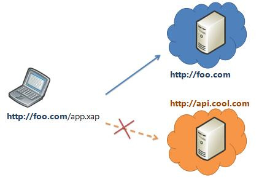

170814

# Js Ajax

## 3. Ajax 요청 및 응답 처리
- 브라우저는 XMLHttpRequest 객체를 이용하여 Ajax 요청을 생성한다. 서버가 브라우저의 요청에 대해 응답을 반환하면 같은 XMLHttpRequest 객체가 그 결과를 처리한다.

- 요청 처리의 예이다.
```javascript
// XMLHttpRequest 객체의 생성
var req = new XMLHttpRequest();
// 비동기 방식으로 Request를 오픈한다
req.open('GET', 'data/test.json', true);
// Request를 전송한다
req.send();
```

- 응답 처리의 예이다.(event로 처리한다.)
```javascript
// XMLHttpRequest.readyState 프로퍼티가 변경(이벤트 발생)될 때마다 콜백함수(이벤트 핸들러)를 호출한다.
req.onreadystatechange = function (e) {
  // readyStates는 XMLHttpRequest의 상태(state)를 반환
  // readyState: 4 => DONE(서버 응답 완료)
  if (req.readyState === XMLHttpRequest.DONE) {
    // status는 response 상태 코드를 반환 : 200 => 정상 응답
    if(req.status == 200) {
      console.log(req.responseText);
    } else {
      console.log("Error!");
    }
  }
};
```
> XMLHttpRequest.readyState 서버의 state를 나타낸다.

- readXMLHttpRequest.readyState의 값은 아래와 같다
  - 0	UNSENT	XMLHttpRequest.open() 메소드 호출 이전
  - 1	OPENED	XMLHttpRequest.open() 메소드 호출 완료
  - 2	HEADERS_RECEIVED	XMLHttpRequest.send() 메소드 호출 완료
  - 3	LOADING	서버 응답 중(XMLHttpRequest.responseText 미완성 상태)
  - `4	DONE	서버 응답 완료` 

```javascript
// XMLHttpRequest 객체의 생성
var req = new XMLHttpRequest();
// 비동기 방식으로 Request를 오픈한다
req.open('GET', 'data/test.json', true);
// Request를 전송한다
req.send();

// XMLHttpRequest.readyState 프로퍼티가 변경(이벤트 발생)될 때마다 콜백함수(이벤트 핸들러)를 호출한다.
req.onreadystatechange = function (e) {
  // 이 함수는 Response가 클라이언트에 도달하면 호출된다.

  // readyStates는 XMLHttpRequest의 상태(state)를 반환
  // readyState: 4 => DONE(서버 응답 완료)
  if (req.readyState === XMLHttpRequest.DONE) {
    // status는 response 상태 코드를 반환 : 200 => 정상 응답
    if(req.status == 200) {
      console.log(req.responseText);
    } else {
      console.log("Error!");
    }
  }
};
```
- XMLHttpRequest의.readyState가 4인 경우, 서버 응답이 완료된 상태이므로 이후 XMLHttpRequest.status가 200(정상 응답)임을 확인하고 정상인 경우, XMLHttpRequest.responseText를 취득한다.

> 서버가 전송한 데이터는  XMLHttpRequest.responseText에 담겨있다.

## 4. JSON

```json
{
  "name": "Lee",
  "gender": "male",
  "age": 20,
  "alive": true
}
```
- `반드시 ""를 붙여야한다.`
- 여러개의 값을 보낼때는 `배열로` 보내야한다.
- `JSON.stringify() 메소드는 객체를 JSON 형식의 문자열로 변환한다.`

```javascript
var o = {
  name: "Lee",
  gender: "male"
};

// 객체 => JSON 형식의 문자열
var strObject = JSON.stringify(o);
console.log(typeof strObject, strObject); // string '{"name":"Lee","gender":"male"}'

var arr = [1, 5, "false"];

// 배열 객체 => 문자열
var strArray = JSON.stringify(arr);
console.log(typeof strArray, strArray); // string '[1, 5, "false"]'
```
- `JSON.parse() 메소드는 JSON 데이터를 가진 문자열을 객체로 변환한다.`
  - 서버로부터 브라우저로 전송된 JSON 데이터는 문자열이다. 이 문자열을 객체화하여야 하는데 이를 역직렬화(Deserializing)이라 한다. 

## 5. Web Server

- Express 서버 설치

```bash
## 데스크탑에 webserver-express 폴더가 생성된다.
$ cd ~/Desktop
$ git clone https://github.com/ungmo2/webserver-express.git
$ cd webserver-express
## install express
$ npm i
```

## 6. Ajax

### 6.1 Load HTML

```html
<!-- 루트 폴더(htdocs)/loadhtml.html -->
<!DOCTYPE html>
<html>
  <head>
    <meta charset="UTF-8">
    <link rel="stylesheet" href="http://poiemaweb.com/assets/css/ajax.css">
  </head>
  <body>
    <div id="content"></div>

    <script>
      // XMLHttpRequest 객체의 생성
      var req = new XMLHttpRequest();
      // 비동기 방식으로 Request를 오픈한다
      req.open('GET', 'data/data.html', true);
      // Request를 전송한다
      req.send();

      // Event Handler
      req.onreadystatechange = function () {
        // 서버 응답 완료 && 정상 응답
        if (req.readyState === XMLHttpRequest.DONE) {
          if (req.status == 200) { // 정상응답
            console.log(req.responseText); // 받은 데이터를 console에다가 찍는다.

            document.getElementById('content').innerHTML = req.responseText;
          
            // document.getElementById('content').insertAdjacentHTML('beforeend', req.responseText);
          } else {
            console.log('[' + req.status + ']: ' + req.statusText);
          }
        }
      };
    </script>
  </body>
</html>
```

```html
<!-- 루트 폴더(htdocs)/data/data.html -->
<div id="tours">
  <h1>Guided Tours</h1>
  <ul>
    <li class="usa tour">
      <h2>New York, USA</h2>
      <span class="details">$1,899 for 7 nights</span>
      <button class="book">Book Now</button>
    </li>
    <li class="europe tour">
      <h2>Paris, France</h2>
      <span class="details">$2,299 for 7 nights</span>
      <button class="book">Book Now</button>
    </li>
    <li class="asia tour">
      <h2>Tokyo, Japan</h2>
      <span class="details">$3,799 for 7 nights</span>
      <button class="book">Book Now</button>
    </li>
  </ul>
</div>
```

### 6.2 Load JSON
- 서버로부터 브라우저로 전송된 JSON 데이터는 문자열이다. 이 문자열을 객체화하여야 하는데 이를 역직렬화(Deserializing)이라 한다. 역직렬화를 위해서 내장 객체 JSON의 static 메소드인 `JSON.parse()를 사용한다.`

```html
<!-- 루트 폴더(htdocs)/loadjson.html -->
<!DOCTYPE html>
<html>
  <head>
    <meta charset="UTF-8">
    <link rel="stylesheet" href="http://poiemaweb.com/assets/css/ajax.css">
  </head>
  <body>
    <div id="content"></div>

    <script>
      // XMLHttpRequest 객체의 생성
      var req = new XMLHttpRequest();

      // 비동기 방식으로 Request를 오픈한다
      req.open('GET', 'data/data.json', true);
      // Request를 전송한다
      req.send();

      req.onreadystatechange = function () {
        // 서버 응답 완료 && 정상 응답
        if (req.readyState === XMLHttpRequest.DONE) {
          if (req.status == 200) {
            console.log(req.responseText);

            // Deserializing (String → Object)
            responseObject = JSON.parse(req.responseText);

            // JSON → HTML String
            var newContent = '';
            newContent += '<div id="tours">';
            newContent += '<h1>Guided Tours</h1>';
            newContent += '<ul>';
            for (var i = 0; i < responseObject.tours.length; i++) {
              newContent += '<li class="' + responseObject.tours[i].region + ' tour">';
              newContent += '<h2>' + responseObject.tours[i].location + '</h2>';
              newContent += '<span class="details">' + responseObject.tours[i].details + '</span>';
              newContent += '<button class="book">Book Now</button>';
              newContent += '</li>';
            }
            newContent += '</ul></div>';

            document.getElementById('content').innerHTML = newContent;
          
            // document.getElementById('content').insertAdjacentHTML('beforeend', newContent);

          } else {
            console.log('[' + req.status + ']: ' + req.statusText);
          }
        }
      };
    </script>
  </body>
</html>
```

```json
{
  "tours": [
    {
      "region": "usa",
      "location": "New York, USA",
      "details": "$1,899 for 7 nights"
    },
    {
      "region": "europe",
      "location": "Paris, France",
      "details": "$2,299 for 7 nights"
    },
    {
      "region": "asia",
      "location": "Tokyo, Japan",
      "details": "$3,799 for 7 nights"
    }
  ]
}
```

### 6.3 Load JSONP
- 동일출처원칙이란? 보안상의 이유로 다른 도메인(http와 https, 포트가 다르면 다른 도메인으로 간주한다)으로의 요청(크로스 도메인 요청)은 제한된다.
  - 동일출처원칙(Same-origin policy) -> json 파일로 받아오면 발생한다.

  

- 동일출처원칙을 우회하는 방법은 세가지가 있다.

1. 웹서버의 프록시 파일
서버에 원격 서버로부터 데이터를 수집하는 별도의 기능을 추가하는 것이다. 이를 프록시(Proxy)라 한다.

> 프록시가 원격 서버로부터 받은서 가진다음에 서버에게 넘겨주는 방식이다.

2. JSONP
script 태그의 원본 주소에 대한 제약이 존재하지 않는데 이것을 이용하여 다른 도메인의 서버에서 데이터를 수집하는 방법이다. 자신의 서버에 함수를 정의하고 다른 도메인의 서버에 얻고자 하는 데이터를 인수로 하는 `함수 호출문을 로드`하는 것이다.  


```html
<!-- 루트 폴더(htdocs)/loadjsonp.html -->
<!DOCTYPE html>
<html>
  <head>
    <meta charset="UTF-8">
    <link rel="stylesheet" href="http://poiemaweb.com/assets/css/ajax.css">
  </head>
  <body>
    <div id='content'></div>

    <script>
    function showTours(data) {
      console.log(data); // data: object

      // JSON → HTML String
      var newContent = '';
      newContent += '<div id="tours">';
      newContent += '<h1>Guided Tours</h1>';
      newContent += '<ul>';
      for (var i = 0; i < data.tours.length; i++) {
        newContent += '<li class="' + data.tours[i].region + ' tour">';
        newContent += '<h2>' + data.tours[i].location + '</h2>';
        newContent += '<span class="details">' + data.tours[i].details + '</span>';
        newContent += '<button class="book">Book Now</button>';
        newContent += '</li>';
      }
      newContent += '</ul></div>';

      document.getElementById('content').innerHTML = newContent;
    }
    </script>
    <script src='http://poiemaweb.com/assets/data/data-jsonp.js'></script>
    <!-- <script>
      showTours({
        "tours": [
          {
            "region": "usa",
            "location": "New York, USA",
            "details": "$1,899 for 7 nights"
          },
          {
            "region": "europe",
            "location": "Paris, France",
            "details": "$2,299 for 7 nights"
          },
          {
            "region": "asia",
            "location": "Tokyo, Japan",
            "details": "$3,799 for 7 nights"
          }
        ]
      });
    </script> -->
  </body>
</html>
```

```javascript
// http://poiemaweb.com/assets/data/data-jsonp.js
showTours({
  "tours": [
    {
      "region": "usa",
      "location": "New York, USA",
      "details": "$1,899 for 7 nights"
    },
    {
      "region": "europe",
      "location": "Paris, France",
      "details": "$2,299 for 7 nights"
    },
    {
      "region": "asia",
      "location": "Tokyo, Japan",
      "details": "$3,799 for 7 nights"
    }
  ]
});
```
3. Cross-Origin Resource Sharing
HTTP 헤더에 추가적으로 정보를 추가하여 브라우저와 서버가 서로 통신해야 한다는 사실을 알게하는 방법이다. W3C 명세에 포함되어 있지만 최신 브라우저에서만 동작하며 서버에 HTTP 헤더를 설정해 주어야 한다.
