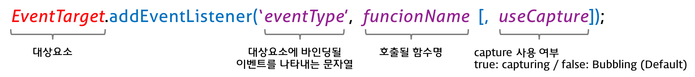

170814

# Js Event

## 1. Introduction

## 2. 동기식 처리 모델 vs 비동기식 처리 모델
- server에서 ajax를 통해서 데이터를 던지면 그것을 client가 받는 방식을 나타낸다.
- 전통적으로는 새로운 HTML을 불러와서 load부터 다시한다.
- 현재는 DOM Manipulation(조작)을 통하여서 ajax 통신을 한다.
  - 서버가 존재해야한다.

- 동기식 : 커피를 주문하고 커피가 나올때까지 대기한다.
  - 직렬적으로 작업을 수행한다 즉 순차적으로 실행되며 작업이 수행중이면 다음 작업은 대기하게 된다.
  - `Blocking방식이다.`

- 비동기식 : 커피를 주문하고 할일을 하고 있다가 커피를 받는다.
  - 병렬적으로 작업을 수행한다  즉 작업이 종료되지 않은 상태라도 대기하지 않고 다음 작업을 실행한다는 의미이다.
  - `Non-Blocking방식이다.`

```javascript
function func1() {
  console.log('func1');
  func2();
}

function func2() {
  setTimeout(function() {
    console.log('func2');
  }, 0);

  func3();
}

function func3() {
  console.log('func3');
}

func1();
```

> setTimeout을 서버에 요청을 하고 바로 func3를 실행하기에 func1, func3, func2순서로 나온다. setTimeout은 모든 동기식이 실행된 후에 실행된다.

## 3. 이벤트 루프(Event Loop)와 동시성(Concurrency)
- 브라우저는 `단일 쓰레드(single-thread)`에서 `이벤트 드리븐(event-driven)` 방식으로 동작한다.

- 자바스크립트의 동시성(Concurrency)을 지원하는 것이 바로 `이벤트 루프(Event Loop)`이다.

- `js는 비동기를 못하지만 그것을 browser가 한다.`

> thread란 컴퓨터가 일을 할때 한번에 일을 할 수 있는 정도를 나타낸다.

> 이벤트 드리븐(event-driven) 방식이란? 모든 application이 이벤트 방식으로 동작한다.

  - 이벤트루프와 브라우저의 환경  


  - Web API는 browser의 영역으로써 Ajax, DOM Events, Timer등이 있다.

- 구글의 V8을 비롯한 대부분의 자바스크립트 엔진은 크게 2개의 영역으로 나뉜다.
  - Call Stack(호출 스택) == 실행 컨텍스트
    - 작업이 요청되면(함수가 실행되면) 요청된 작업은 순차적으로 Call Stack에 쌓이게 되고 순차적으로 실행된다. 자바스크립트는 단 하나의 Call Stack을 사용하기 때문에 해당 task가 종료하기 전까지는 다른 어떤 task도 수행될 수 없다.
  - Heap
    - 동적으로 생성된 객체 인스턴스가 할당되는 영역이다.

-  자바스크립트 엔진은 단순히 작업이 요청되면 요청된 작업을 Call Stack을 사용하여 순차적으로 실행할 뿐이다. 앞에서 언급한 동시성(Concurrency)을 지원하기 위해 필요한 비동기 요청(이벤트를 포함) 처리는 자바스크립트 엔진을 구동하는 환경 `즉 브라우저(또는 Node.js)가 담당한다.`

- Event Queue(Task Queue)
  - 비동기 처리 함수의 콜백 함수, 비동기식 이벤트 핸들러, Timer 함수(setTimeout(), setInterval())가 보관되는 영역으로 이벤트 루프(Event Loop)에 의해 특정 시점(Call Stack이 비어졌을 때)에 순차적으로 Call Stack으로 이동되어 실행된다.
- Event Loop(이벤트 루프)
  - Call Stack내에서 현재 실행중인 task가 있는지 그리고 Event Queue에 task가 있는지 반복하여 확인한다.

## 4. 이벤트의 종류

### 4.1 UI Event
- 웹페이지가 로드될때
  - load	웹페이지의 로드가 완료되었을 때
  - unload	웹페이지가 언로드될 때(주로 새로운 페이지를 요청한 경우)
  - error	브라우저가 자바스크립트 오류를 만났거나 요청한 자원이 존재하지 않는 경우
  - resize	브라우저 창의 크기를 조절했을 때
  - scroll	사용자가 페이지를 위아래로 스크롤할 때
  - select	텍스트를 선택했을 때

> script문을 제일 하단에 써줘야하는 이유는 html이 전부다가 load되면 js를 실행하게 하기위해서이다.

### 4.2 Keyboard Event
  - keydown	키를 누르고 있을 때
  - keyup	누르고 있던 키를 뗄 때
  - keypress 키를 누르고 뗏을 때

### 4.3 Mouse Event
  - click	마우스 버튼을 클릭했을 때
  - dbclick	마우스 버튼을 더블 클릭했을 때
  - mousedown	마우스 버튼을 누르고 있을 때
  - mouseup	누르고 있던 마우스 버튼을 뗄 때
  - mousemove	마우스를 움직일 때 (터치스크린에서 동작하지 않는다)
  - mouseover	마우스를 요소 위로 움직였를 때 (터치스크린에서 동작하지 않는다) // hover와 비슷
  - mouseout	마우스를 요소 밖으로 움직였를 때 (터치스크린에서 동작하지 않는다)

### 4.4 Focus Event
  - focus/focusin	요소가 포커스를 얻었을 때
  - blur/foucusout	요소가 포커스를 잃었을 때


### 4.5 Form Event
  - input	input 또는 textarea 요소의 값이 변경되었을 때, contenteditable 어트리뷰트를 가진 요소의 값이 변경되었을 때
  - change	select box, checkbox, radio button의 상태가 변경되었을 때
  - submit	form을 submit할 때 (버튼 또는 키)
  - reset	reset 버튼을 클릭할 때 (최근에는 사용 안함)

### 4.6 Clipboard Event
  - cut	콘텐츠를 잘라내기할 때
  - copy	콘텐츠를 복사할 때
  - paste	콘텐츠를 붙여넣기할 때

## 5. Event Binding

### 5.1 HTML Event Handler
- HTML 요소의 이벤트 어트리뷰트에 이벤트 핸들러를 대응시키는 방법이다.
  - 자주 사용되지 않는다.

```html
<!DOCTYPE html>
<html>
<body>
  <button onclick="myFunction()">Click me</button>
  <script>
    function myFunction() {
      alert('Button clicked!');
    }
  </script>
</body>
</html>
```

### 5.2 전통적(Traditional) DOM Event Handler
- HTML Event Handler처럼 HTML과 Javascript가 혼용되는 문제는 해결되었으나 이벤트 핸들러에 하나의 함수만을 바인딩할 수 있으며 `함수에 인수를 전달할 수 없는 단점이 있다.`
- 추천하는 방식이 아니다. EventHandler방식을 사용한다.

```html
<!DOCTYPE html>
<html>
<body>
  <button id="btn">Click me</button>
  <script>
    var btn = document.getElementById('btn');

    // 첫번째 바인딩된 이벤트 핸들러 => 실행되지 않는다.
    btn.onclick = function () {
      alert('Button clicked 1');
    };

    // 두번째 바인딩된 이벤트 핸들러
    btn.onclick = function () {
      alert('Button clicked 2');
    };

    // 첫번째 바인딩된 이벤트 핸들러 !!! 이것을 추천한다.
    btn.addEventListener('click', function () {
      alert('Button clicked 1');
    });

    // 두번째 바인딩된 이벤트 핸들러
    btn.addEventListener('click', function () {
      alert('Button clicked 2');
    });
  </script>
</body>
</html>

```
### 5.3 DOM Level 2 Event Listener(최근 트렌드)
- addEventListener() 함수를 이용하여 대상 요소에 이벤트를 바인딩하고 해당 이벤트가 발생했을 때 실행될 콜백 함수를 지정한다.  


  - Bubbling은 event를 발생한 곳에서부터 위로 올라가는 방식이다.
  - capturing은 처음부터 아래로 내려오는 방식이다.

- addEventListener()는 이전에 방식에 비해 보다 나은 장점을 갖는다.
  - `하나의 이벤트에 대해 하나 이상의 핸들러를 추가할 수 있다.`
  - 캡처링과 버블링를 지원한다.
  - HTML 요소뿐만아니라 모든 DOM 요소에 대해 동작한다.

- `addEventListener()` 함수는 IE9 이상에서 동작한다. IE 8 이하에서는 `attachEvent()` 함수를 사용한다.

- IE 버전에 대한 방어코드이다.
```javascript
if (elem.addEventListener) {    // IE 9 ~  존재여부 파악
  elem.addEventListener('click', func); 
} else if (elem.attachEvent) {  // ~ IE 8
  elem.attachEvent('onclick', func);
}
```

- addEventListener()의 사용 예제를 살펴보자.

```html
<!DOCTYPE html>
<html>
<body>
  <script>
    addEventListener('click', function() {
      alert('Clicked!');
    });
  </script>
</body>
</html>
```
- 위와 같이 대상요소(target)를 지정하지 않으면 click 이벤트는 전역객체 window에 바인딩된다.
  - scroll 잡을때 사용된다.

```html
<!DOCTYPE html>
<html>
<body>
  <label for='username'>User name </label>
  <input type='text' id='username'>
  <script>
    var elem = document.getElementById('username');
    elem.addEventListener('blur', function() { // blur는 포커스가 빠질때
      alert('blur event occurred!');
    });
  </script>
</body>
</html>

```
> addEventListener 안에 function의 호출이 없는데 브라우저에 의해서 실행이 된다.


- input 요소를 blur 이벤트에 바인딩하였다. 사용자 이름이 최소 2자 이상이야한다는 규칙을 세우고 이에 부합하는지 확인하는 처리를 한다.

```html
<!DOCTYPE html>
<html>
<body>
  <label for="username">User name </label>
  <input type="text" id="username">
  <em id="message"></em>
  <script>
    var elem = document.getElementById('username');
    var msg  = document.getElementById('message');

    elem.addEventListener('blur', function () {
      if (elem.value.length < 2) { 
        msg.innerHTML = '이름은 2자 이상 입력해 주세요';
      } else {
        msg.innerHTML = '';
      }
    });
  </script>
</body>
</html>
```
- value(사용자에 의해 입력된 값)을 가져온다.
- 2자 이상이라는 `규칙을 상수화하고 함수의 인수로 전달도록 수정`하자. 이렇게 하면 규칙이 변경되어도 함수는 수정하지 않아도 된다.

```javascript
function foo() {
  alert('clicked!');
}
// elem.addEventListener('click', foo()); // 이벤트 발생 시까지 대기하지 않고 바로 실행된다
elem.addEventListener('click', foo);      // 이벤트 발생 시까지 대기한다
```

> // elem.addEventListener('click', foo()); // 이벤트 발생 시까지 대기하지 않고 바로 실행된다. `elem.addEventListener('click', foo);      // 이벤트 발생 시까지 대기한다` 이것을 사용해야하며 헷갈리지 않도록 조심해야한다.

- 문제점으로는 인수를 전달할 수 없는 문제가 발생한다. `아래의 방법으로 우회하며 중요하다.`

```javascript
var MIN_USER_NAME_LENGTH = 2; // 이름 최소 길이

var elem = document.getElementById('username');
var msg  = document.getElementById('message');

function checkUserNameLength(n) {
  if(elem.value.length < n) {
    msg.innerHTML = '이름은 ' + n + '자 이상이어야 합니다';
  } else {
    msg.innerHTML = '';
  }
}

elem.addEventListener('blur', function() {
  checkUserNameLength(MIN_USER_NAME_LENGTH);
});

```

## 6. 핸들러 함수 내부의 this

### 6.1 HTML Event Handler

- HTML Event Handler 방식의 경우, 이벤트 핸들러 내부의 `this는 window`를 가리킨다.

```html
<!DOCTYPE html>
<html>
<body>
  <button onclick="foo()">Button</button>
  <script>
    function foo () {
      console.log(this); // window
      console.log(event.currentTarget); // <button onclick="foo()">Button</button>
    }
  </script>
</body>
</html>
```

### 6.2 전통적(Traditional) DOM Event Handler

- Traditional DOM Event Handler 방식에서 이벤트 핸들러 내부의 `this는 이벤트에 바인딩된 요소를` 가리킨다. 이것은 이벤트 객체의 currentTarget 프로퍼티와 같다.
  - function이 method이기 때문이다.
```html
<!DOCTYPE html>
<html>
<body>
  <button id="btn">Button</button>
  <script>
    var btn = document.getElementById('btn');
    btn.onclick = function() {
      console.log(this); // <button id="btn">Button</button>
      console.log(event.currentTarget); // <button id="btn">Button</button>
      console.log(this === event.currentTarget); // true
    };
  </script>
</body>
</html>
```

### 6.3 DOM Level 2 Event Listener

- addEventListener() 함수에서 지정한 이벤트 핸들러 내부의 `this는 이벤트 리스너에 바인딩된 요소(currentTarget)`를 가리킨다. 이것은 이벤트 객체의 currentTarget 프로퍼티와 같다.
  - 이것이 꼭 event를 발생시키는 것이아닌 발생시킬 수 도 있고 안시킬 수도 있다.

```html
<!DOCTYPE html>
<html>
<body>
  <button id="btn">Button</button>
  <script>
    var elem = document.getElementById('btn');
    elem.addEventListener('click', function (event) {
      console.log(this); // <button id="btn">Button</button>
      console.log(event.currentTarget); // <button id="btn">Button</button>
      console.log(this === event.currentTarget); // true
    });
  </script>
</body>
</html>
```

## 7. Event Flow (이벤트의 흐름)
- `(true) Cpature phase는 window부터 아래로 흘러갔다가 다시 window까지 올라온다.`
- `기본값 (false) Bubbling phase는 event시점부터 window까지만 올라간다.`
- DOM-Level-3-Event


```html
<!DOCTYPE html>
<html>
<head>
  <style>
    html { border:1px solid red; padding:30px; text-align: center; }
    body { border:1px solid green; padding:30px; }
    .top {
      width: 300px; height: 300px;
      background-color: red;
      margin: auto;
    }
    .middle {
      width: 200px; height: 200px;
      background-color: blue;
      position: relative; top: 34px; left: 50px;
    }
    .bottom {
      width: 100px; height: 100px;
      background-color: yellow;
      position: relative; top: 34px; left: 50px;
      line-height: 100px;
    }
  </style>
</head>
<body>
  body
  <div class="top">top
    <div class="middle">middle
      <div class="bottom">bottom</div>
    </div>
  </div>
  <script>
  // true: capturing / false: bubbling
  var useCature = true;

  var handler = function (event) {
    var phases = ['capturing', 'target', 'bubbling'];
    var node = this.nodeName + (this.className ? '.' + this.className : '');
    // eventPhase: 이벤트 흐름 상에서 어느 phase에 있는지를 반환한다.
    // 0 : 이벤트 없음 / 1 : 캡처링 단계 / 2 : 타깃 / 3 : 버블링 단계
    console.log(node, phases[event.eventPhase - 1]);
    alert(node + ' : ' + phases[event.eventPhase - 1]);
  }

  document.querySelector('html').addEventListener('click', handler, useCature);
  document.querySelector('body').addEventListener('click', handler, useCature);

  document.querySelector('div.top').addEventListener('click', handler, useCature);
  document.querySelector('div.middle').addEventListener('click', handler, useCature);
  document.querySelector('div.bottom').addEventListener('click', handler, useCature);
  </script>
</body>
</html>
```
- capturing이 html, body, top, middle, bottom순으로 작동하며 bubbling은 반대로 작동한다.
  - `단 capturing은 bottom에서 다시 html로 올라가지만 그것을 보여주지는 않는다.`

```html
<!DOCTYPE html>
<html>
<head>
  <style>
    html, body { height: 100%; }
  </style>
<body>
  <p>A paragraph with a <button>button</button>.</p>
  <script>
    var body = document.querySelector('body');
    var para = document.querySelector('p');
    var button = document.querySelector('button');

    // 버블링
    body.addEventListener('mousedown', function() {
      console.log('Handler for body.');
    });

    // 버블링
    para.addEventListener('mousedown', function() {
      console.log('Handler for paragraph.');
    });

    // 버블링
    button.addEventListener('mousedown', function(event) {
      console.log('Handler for button.');
    });
  </script>
</body>
</html>
```
- 3번째 인자를 주지않아서 default값이 false즉 bubbling이 발생한다.
- button을 눌렀다고 가정한다면 값을 실행하면 `Handler for button.  ->  Handler for paragraph. -> Handler for body.` 순으로 이벤트가 발생한다.
  - bubbling이라서 발생한 곳에서 부터 위로 찍힌다.
  - capturing은 위에서부터 이벤트가 발생한 곳 까지내려간다.


- 아래는 캡처링의 경우이다.
```html
<!DOCTYPE html>
<html>
<head>
  <style>
    html, body { height: 100%; }
  </style>
<body>
  <p>A paragraph with a <button>button</button>.</p>
  <script>
    var body = document.querySelector('body');
    var para = document.querySelector('p');
    var button = document.querySelector('button');

    // 캡처링
    body.addEventListener('mousedown', function() {
      console.log('Handler for body.');
    }, true);

    // 캡처링
    para.addEventListener('mousedown', function() {
      console.log('Handler for paragraph.');
    }, true);

    // 캡처링
    button.addEventListener('mousedown', function(event) {
      console.log('Handler for button.');
    }, true);
  </script>
</body>
</html>
```
- capturing이라서 누른곳까지 내려와서 한다.

- `이벤트가 발생하면 무조건 cpaturing으로 내려왔다가 bubbling으로 올라가는데 어떤 것을 선택할지 사용자들이 선택하는것이다.`
- 다음은 캡처링과 버블링이 혼용되는 경우이다.

```html
<!DOCTYPE html>
<html>
<head>
  <style>
    html, body { height: 100%; }
  </style>
<body>
  <p>A paragraph with a <button>button</button>.</p>
  <script>
    var body = document.querySelector('body');
    var para = document.querySelector('p');
    var button = document.querySelector('button');

    // 버블링
    body.addEventListener('mousedown', function() {
      console.log('Handler for body.');
    });

    // 캡처링
    para.addEventListener('mousedown', function() {
      console.log('Handler for paragraph.');
    }, true);

    // 버블링
    button.addEventListener('mousedown', function(event) {
      console.log('Handler for button.');
    });
  </script>
</body>
</html>
```
- `이벤트가 발생한 시점의 function이 false인지 true인지 기준으로 bubling인지 capturing인지 결정된다.`

## 8. Event 객체

- 이벤트가 발생하면 event 객체는 동적으로 생성되며 이벤트를 처리할 수 있는 이벤트 핸들러에 인자로 전달된다.

```html
<!DOCTYPE html>
<html>
<body>
  <p>클릭하세요. 클릭한 곳의 좌표가 표시됩니다.</p>
  <em id="message"></em>
  <script>
  function showCoords(e) { // e: event object
    var msg = document.getElementById('message');
    msg.innerHTML =
      'clientX value: ' + e.clientX + '<br>' +
      'clientY value: ' + e.clientY;
  }
  addEventListener('click', showCoords);
  </script>
</body>
</html>
```
- 'click'은 첫번째 인자로 들어간다.


### 8.1 Event Property

####  8.1.1 Event.target

- `이벤트를 발생시킨 요소`를 가리킨다.
  - `this는 언제나 currentTarget과 일치한다.`
  - currentTarget은 이벤트를 실행할 수도 안할 수도 있다.

```html
<!DOCTYPE html>
<html>
<body>
  <button>Hide me</button>
  <script>
  function hide(e) {
    e.target.style.visibility = 'hidden';
  }

  document.querySelector('button').addEventListener('click', hide);
  </script>
</body>
</html>
```

#### 8.1.2 Event.currentTarget
- 이벤트 리스너에 바인딩된 요소를 가리킨다.
- `이것이 this이다.`

```html
<!DOCTYPE html>
<html>
<head>
  <style>
    html, body { height: 100%; }
    div { height: 100%; }
  </style>
</head>
<body>
  <div>
    <button>배경색 변경</button>
  </div>
  <script>
    function bluify(e) {
      // this: 이벤트 리스너에 바인딩된 요소(div 요소)
      console.log('this: ', this);
      // target: 이벤트를 발생시킨 요소(button 요소 또는 div 요소)
      console.log('e.target:', e.target);
      // currentTarget: 이벤트 리스너에 바인딩된 요소(div 요소)
      console.log('e.currentTarget: ', e.currentTarget);

      // 언제나 true
      console.log(this === e.currentTarget);
      // currentTarget과 target이 같은 객체일 때 true
      console.log(this === e.target);

      // click 이벤트가 발생하면 이벤트를 발생시킨 요소(target)과는 상관없이 this(이벤트 리스너에 바인딩된 요소(div 요소))의 배경색이 변경된다.
      this.style.backgroundColor = '#A5D9F3';
    }
    
    // div 요소에 이벤트 핸들러가 바인딩되어 있다. 
    // 자식 요소인 button이 발생시킨 이벤트가 버블링되어 div 요소에도 전파된다.
    // 따라서 div 요소에 이벤트 핸들러가 바인딩되어 있으면 자식 요소인 button이 발생시킨 이벤트를 div 요소에서도 핸들링할 수 있다.
    document.querySelector('div').addEventListener('click', bluify);
  </script>
</body>
</html>

```
- div를 클릭하였을때 event가 발생하면 target과 this(current.target)은 div로 같다.
- button를 클릭하였을때 event가 발생하면 target은 button, this는 div이다.

#### 8.1.3 Event.type

- 발생한 이벤트의 종류를 나타내는 문자열을 반환한다.

```html
<!DOCTYPE html>
<html>
<body>
  <p>키를 입력하세요</p>
  <em id="message"></em>
  <script>
  function getEventType(e) {
    console.log(e);
    // keycode는 어떤키가 입력되었는지를 받아온다.
    document.getElementById('message').innerHTML = e.type + ' : ' + e.keyCode;
  }

  var body = document.querySelector('body');

  body.addEventListener('keydown', getEventType);
  body.addEventListener('keyup', getEventType);
  </script>
</body>
</html>
```

#### 8.1.4 Event.cancelable

- 요소의 기본 동작을 취소시킬 수 있는지 여부(true/false)를 나타낸다.

```html
<!DOCTYPE html>
<html>
<body>
  <a href="poiemaweb.com">Go to poiemaweb.com</a>
  <script>
  var elem = document.querySelector('a');

  elem.addEventListener('click', function (e) {
    console.log(e.cancelable);

    // 기본 동작을 중단시킨다.
    e.preventDefault();
  });
  </script>
</body>
</html>
```
- a 요소의 기본요소인 링크이동을 cancel할 수 있다.
- 취소할 수 있으면 true아니면 false가 나온다.

#### 8.1.5 Event.eventPhase

- 이벤트 흐름(event flow) 상에서 어느 단계(event phase)에 있는지를 반환한다.

  - 0	이벤트 없음
  - 1	캡쳐링 단계
  - 2	타깃
  - 3	버블링 단계
    - 캡쳐링 단계에서 event phase를 반환하면 1,2 번이나온다.
    - 버블링 단계에서는 2,3번이 나온다.

### 8.2 Event Method

#### 8.2.1 Event.preventDefault()

- 이벤트의 기본 동작을 취소한다. 단 Event.cancelable가 true일 경우에 한한다.

#### 8.2.2 Event.stopPropagation()

- 이벤트의 전파(propagation: 버블링, 캡처링)를 중단한다.

### 9. Event Delegation (이벤트 위임)

```html
<ul id="parent-list">
  <li id="post-1">Item 1</li>
  <li id="post-2">Item 2</li>
  <li id="post-3">Item 3</li>
  <li id="post-4">Item 4</li>
  <li id="post-5">Item 5</li>
  <li id="post-6">Item 6</li>
</ul>
```
- 모든 li 요소가 클릭 이벤트에 반응하는 처리를 구현하고 싶은 경우 너무 많은 소요가 발생한다.
- 이벤트 위임(Event Delegation)은 다수의 자식 요소에 이벤트 핸들러를 바인딩하는 대신 `하나의 부모 요소에 이벤트 핸들러를 바인딩하는 방법이다`. 

```html
<!DOCTYPE html>
<html>
<body>
  <ul id="parent-list">
    <li id="post-1">Item 1</li>
    <li id="post-2">Item 2</li>
    <li id="post-3">Item 3</li>
    <li id="post-4">Item 4</li>
    <li id="post-5">Item 5</li>
    <li id="post-6">Item 6</li>
  </ul>
  <div id="msg">
  <script>
    var msg = document.getElementById('msg');

    document.getElementById('parent-list').addEventListener('click', function (e) {
      console.log('[target]: ' + e.target);
      // nodeName 프로퍼티를 사용하여서 태그명을 찾아올수있다.
      console.log('[target.nodeName]: ' + e.target.nodeName);

      // list item이면 // e.target이 null이면 안되서 먼저 써준다.
      if (e.target && e.target.nodeName == 'LI') {
        msg.innerHTML = 'li#' + e.target.id + ' was clicked!';
      }
    });
  </script>
</body>
</html>
```

## 10. 기본 동작의 변경

- 이벤트 객체는 요소의 기본 동작과 요소의 부모 요소들이 이벤트에 대응하는 방법을 변경하기 위한 메소드는 가지고 있다.

### 10.1 Event.preventDefault()

- 폼을 submit하거나 링크를 클릭하면 다른 페이지로 이동하게 된다. 이러한 요소가 가지고 있는 기본 `동작을 중단시키기 위한 메소드가 preventDefault()이다.`

> Ajax 통신을 하게될경우 submit의 기본동작을 중단시켜야한다 안할시 2번요청이간다.

```html
<!DOCTYPE html>
<html>
<body>
  <a href="http://www.google.com">go</a>
  <script>
  document.querySelector('a').addEventListener('click', function(e) {
    console.log(e.target, e.target.nodeName);

    // a 요소의 기본 동작을 중단한다.
    e.preventDefault();

    // 이밑에 ajax의 코드를 입력한다.

  });
  </script>
</body>
</html>
```

### 10.2 Event.stopPropagation()
- 부모 요소와 자식 요소의 이벤트를 각각 별도로 처리하기 위해 button 요소의 이벤트의 전파(버블링)를 중단시키기 위해서는 `stopPropagation 메소드`를 사용하여 이벤트 전파를 중단할 필요가 있다.

- 버블링을 중단하고 각자의 경우를 한번씩만 사용하고 싶을때

```html
<!DOCTYPE html>
<html>
<head>
  <style>
    html, body { height: 100%;}  
  </style>
</head>
<body>
  <p>A paragraph with a <button>button</button>.</p>
  <script>
    var body = document.querySelector('body');
    var para = document.querySelector('p');
    var button = document.querySelector('button');

    // 버블링
    body.addEventListener('mousedown', function () {
      console.log('Handler for body.');
    });

    // 버블링
    para.addEventListener('mousedown', function () {
      console.log('Handler for paragraph.');
    });

    // 버블링
    button.addEventListener('mousedown', function (event) {
      console.log('Handler for button.');

      // 3번은 오른쪽을 뜻한다. mouse 오른쪽 버튼 클릭 시, 이벤트 전파를 중단한다.
      if (event.which === 3) event.stopPropagation();
    });
  </script>
</body>
</html>
```

### 10.3 preventDefault & stopPropagation

- 기본 동작의 중단과 버블링 또는 캡처링의 중단을 동시에 실시하는 방법은 아래와 같다.

```javascript
return false;
```

- 단 이 방법은 jQuery를 사용할 때와 아래와 같이 사용할 때만 적용된다.

```html
<!DOCTYPE html>
<html>
<body>
  // onclick에 return을 써줘야한다.
  <a href="http://www.google.com" onclick='return handleEvent()'>go</a>
  <script>
  function handleEvent() {
    return false;
  }
  </script>
</body>
</html>
```

- jquery에서의 사용법이다.

```html
<!DOCTYPE html>
<html>
<body>
  <div>
    <a href="http://www.google.com">go</a>
  </div>
  <script src="https://ajax.googleapis.com/ajax/libs/jquery/1.12.3/jquery.min.js"></script>
  <script>

  // within jQuery
  $('a').click(function (e) {
    e.preventDefault(); // OK a link를 클릭해도 이동하지 않게된다.
  });

  $('a').click(function () {
    return false; // OK --> e.preventDefault() & e.stopPropagation().
  });

  // pure js
  document.querySelector('a').addEventListener('click', function(e) {
    // e.preventDefault(); // OK
    return false;       // NG!!!!!
  });
  </script>
</body>
</html>
```

> js에서 사용하고 싶다면 e.preventDefault(), e.stopPropagation()를 써야한다.

