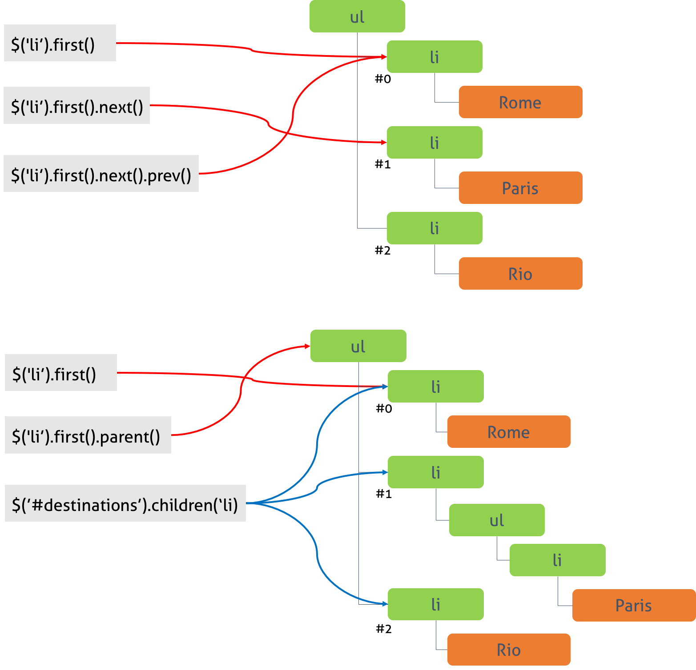

170815

# Jq Basic

##  1. Introduction

- jQuery는 존 레식이 2006년에 발표한 크로스 플랫폼을 지원하는 경량의 자바스크립트 라이브러리이다. 

- jQuery의 특징
  - 크로스 플랫폼을 지원하는 jQuery는 어떠한 브라우저에서도 동일하게 동작한다. 이것은 브라우저 호환성을 고려하여 대체 코드(Polyfill)를 작성할 필요가 없다는 것을 의미한다.
  - 네이티브 DOM API(DOM Query, Traversing, Manipulation 등)보다 직관적이고 편리한 API를 제공한다. CSS 스타일의 selector를 사용할 수 있으며 조작 또한 강력하며 유연하다.
  - 이벤트 처리, Ajax, Animation 효과를 쉽게 사용할 수 있다.
  - 다양한 플러그인이 존재하며 다른 라이브러리들과 충돌을 일으키지 않는다.

##  2. jQuery의 설치

- jQuery 1.x과 jQuery 2.x 두가지 버전이 존재한다. 두가지 버전 모두 동일한 API을 제공하지만 jQuery 2.x는 IE 8 이하를 지원하지 않으므로 주의가 필요하다. 

### 2.1 npm download

```bash
$ npm install jquery

```

## 3.jQuery 함수

- jQuery 객체를 생성하기 위해서는 jQuery 함수를 사용한다.

```javascript
jQuery() 
$() // 축약형
```

### 3.1 CSS 스타일의 selector를 인수로 전달받을 때

- jQuery는 CSS 스타일의 selector를 이용하여 요소를 선택할 수 있다.

```javascript
jQuery('h1');
$('h1');
```
- `jQuery() 함수는 선택자에 의해 선택된 요소들을 jQuery 객체를 반환한다`
- jQuery() 함수에 의해 생성된 객체를 `Matched set 또는 jQuery selection`이라 한다.
- 묵시적 반복(implicit iteration) 한다.

### 3.2 HTML을 인수로 전달받을 때

- HTML 문자열을 인수로 받으면 새로운 HTML 요소를 생성한다.

```javascript
$('<p id="test">My <em>new</em> text</p>').appendTo('body');

```

### 3.3 JavaScript 객체를 인수로 전달받을 때
- JavaScript 객체(plain object, DOM element, array 등)를 인수로 받으면 그 객체를 jQuery 객체로 wrap한 객체를 반환한다.

```javascript
$('div.foo').click(function () {
  $(this).slideUp();
});

// Define a plain object
var foo = { foo: 'bar', hello: 'world' };

// Pass it to the jQuery function
var $foo = $(foo);

// Accessing property values
var test1 = $foo.prop('foo');
console.log(test1); // bar

// Setting property values
$foo.prop('foo', 'foobar');

// Accessing property values
var test2 = $foo.prop('foo');
console.log(test2); // foobar

```

### 3.4 콜백함수를 인수로 전달받을 때

```html
<!DOCTYPE html>
<html>
  <head>
    <title>jQuery</title>
  </head>
  <body>
    <h1 id="main-heading">What is jQuery?</h1>

    <p>jQuery is the most popular JavaScript library.</p>
    
    <h1>Why should you learn jQuery?</h1>
    
    <p class="note">Note: jQuery functions use the DOM API (like <code>document.getElementById</code>).</p>

    <script src="https://ajax.googleapis.com/ajax/libs/jquery/1.12.4/jquery.min.js"></script>
    <script>
    $(document.function(){
      $('h1').text('Hello');
    });
    </script>
  </body>
</html>

```

- 안전하게 DOM을 조작하기 위해서는 DOM이 완전히 로드된 후 자바스크립트가 실행되는 것이 바람직한데 이를 위해 이벤트 처리가 필요하다.

```javascript
jQuery(document).ready(function () {
  // Do something...
});

// Shorthand for jQuery(document).ready()
$(document).ready(function () {
  // Do something...
});

// Shorthand for $(document).ready()
$(function () {
  // Do something...
});

```
- DOM이 사용될 준비가 되었을때 실행한다.

## 4. Selector

- jQuery는 CSS 스타일의 Selector를 이용하여 요소를 선택할 수 있다. 이것은 자바스크립트 DOM API보다 쉽고 강력하며 유연하다.

### 4.1 태그 / ID / Class 선택자
- jQuery는 반복문 없이 해당하는 모든 요소에 접근/조작할 수 있다. 이를 `묵시적 반복(implicit iteration)`이라 한다.

```html
<!DOCTYPE html>
<html>
  <head>
    <title>jQuery</title>
  </head>
  <body>
    <h1>Where do you want to go?</h1>
    <h2>Travel Destinations</h2>
    <p>Plan your next adventure.</p>
    <ul id="destinations">
      <li>Rome</li>
      <li>Paris</li>
      <li class="promo">Rio</li>
    </ul>

    <script src="https://ajax.googleapis.com/ajax/libs/jquery/1.12.4/jquery.min.js"></script>
    <script>
      $(function () {
        console.log($('li'));
        // [li, li, li.promo, prevObject: n.fn.init(1), context: document, selector: "li"]
        $('li').text('Orlando');
      });
    </script>
  </body>
</html>
```

### 4.2 후손 선택자 (Descendant Selector)
- id가 destinations인 ul 요소의 후손을 모두 선택한다.

```html
<!DOCTYPE html>
<html>
  <head>
    <title>jQuery</title>
  </head>
  <body>
    <h1>Where do you want to go?</h1>
    <h2>Travel Destinations</h2>
    <p>Plan your next adventure.</p>
    <ul id="destinations">
      <li>Rome</li>
      <li>Paris</li>
      <li class="promo">Rio</li>
    </ul>

    <script src="https://ajax.googleapis.com/ajax/libs/jquery/1.12.4/jquery.min.js"></script>
    <script>
      $(function () {
        $('#destinations .promo').text('Orlando');

        // var el = document.querySelectorAll('#destinations .promo');
        // for (var i = 0; i < el.length; i++) {
        //   el[i].textContent = 'Orlando';
        // }
      });
    </script>
  </body>
</html>
```

### 4.3 자식 선택자 (Child Selector)

- 자식 선택자를 사용하여 ul 요소의 자손 중에 li 요소를 선택한다.

```html
<!DOCTYPE html>
<html>
  <head>
    <title>jQuery</title>
  </head>
  <body>
    <h1>Where do you want to go?</h1>
    <h2>Travel Destinations</h2>
    <p>Plan your next adventure.</p>
    <ul id="destinations">
      <li>Rome</li>
      <li>
        <ul id="france">
          <li>Paris</li>
        </ul>
      </li>
      <li class="promo">Rio</li>
    </ul>

    <script src="https://ajax.googleapis.com/ajax/libs/jquery/1.12.4/jquery.min.js"></script>
    <script>
      $(function () {
        $('#destinations > li').text('Orlando').css('color', 'red');

        // var el = document.querySelectorAll('#destinations > li');
        // for (var i = 0; i < el.length; i++) {
        //   el[i].textContent = 'Orlando';
        //   el[i].style.color = 'red';
        // }
      });
    </script>
  </body>
</html>
```

### 4.5 가상 클래스 선택자 (Pseudo-Class Selector)

```html
<!DOCTYPE html>
<html>
  <head>
    <title>jQuery</title>
  </head>
  <body>
    <h1>Where do you want to go?</h1>
    <h2>Travel Destinations</h2>
    <p>Plan your next adventure.</p>
    <ul id="destinations"><li>Rome</li><li>Paris</li><li class="promo">Rio</li></ul>

    <script src="https://ajax.googleapis.com/ajax/libs/jquery/1.12.4/jquery.min.js"></script>
    <script>
      $(function () {
        $('#destinations li:first').css('color', 'red');
        $('#destinations li:last').css('color', 'blue');
        // $('#destinations li:odd').css('color', 'orange');
        // $('#destinations li:even').css('color', 'purple');

        // var el = document.getElementById('destinations');
        // console.log(el.firstChild);
        // console.log(el.lastChild);

        // el.firstChild.style.color = 'red';
        // el.lastChild.style.color = 'blue';
      });
    </script>
  </body>
</html>
```

## 5. Traversing
- Selector를 사용하여 matched set을 생성한 이후, matched set의 요소들과 관련있는 다른 요소에 접근할 수 있다. 이를 DOM 탐색(DOM Traversing)이라 한다.

```html
<!DOCTYPE html>
<html>
  <head>
    <title>jQuery</title>
  </head>
  <body>
    <h1>Where do you want to go?</h1>
    <h2>Travel Destinations</h2>
    <p>Plan your next adventure.</p>
    <ul id="destinations">
      <li>Rome</li>
      <li>Paris</li>
      <li class="promo">Rio</li>
    </ul>

    <script src="https://ajax.googleapis.com/ajax/libs/jquery/1.12.4/jquery.min.js"></script>
    <script>
      $(function () {
        var el1 = $('#destinations li');         // Descendant Selector
        var el2 = $('#destinations').find('li'); // Traversing

        console.log(el1);
        // [li, li, li.promo, prevObject: n.fn.init(1), context: document, selector: "#destinations li"]
        console.log(el2);
        // [li, li, li.promo, prevObject: n.fn.init(1), context: document, selector: "#destinations li"]
      });
    </script>
  </body>
</html>

```
- 위 두 코드는 결과적으로 ul 요소의 후손 중 li 요소를 모두 선택한다. 그러나 Traversing은 선택자 방식보다 더 빠르다.


## 6. Manipulation

- DOM에 새로운 요소를 추가/삭제, 복사, 속성 변경 등을 실시할 수 있다. 이를 DOM 조작(DOM Manipulation)이라 한다.


### 6.1. Appending

- HTML에 의해 생성된 DOM에 새로운 요소를 추가한다. 우선 jQuery 함수를 사용하여 추가할 요소를 생성한다.

```html
<!DOCTYPE html>
<html>
  <head>
    <title>jQuery</title>
  </head>
  <body>
    <ul>
      <li class="vacation">
        <h2>Hawaiian Vacation</h2>
        <button>Get Price</button>
      </li>
    </ul>

    <script src="https://ajax.googleapis.com/ajax/libs/jquery/1.12.4/jquery.min.js"></script>
    <script>
      $(function () {
        var price = $('<p>From $399.99</p>');
        $('.vacation').append(price);
      });
    </script>
  </body>
</html>
```
- DOM에 콘텐츠를 삽입할 때, 위치를 지정할 수 있다. 이때 사용할 수 있는 메소드는 4가지이다.
  - append() : 선택 요소의 닫는 태그 앞에 콘텐츠를 삽입한다.
  - prepend() : 선택 요소의 여는 태그 뒤에 콘텐츠를 삽입한다.
  - after() : 선택 요소의 뒤에 콘텐츠를 삽입한다.
  - before() : 선택 요소의 앞에 콘텐츠를 삽입한다.

### 6.2. Removing
- 요소의 제거는 remove() 메소드를 사용한다.

```html
<!DOCTYPE html>
<html>
  <head>
    <title>jQuery</title>
  </head>
  <body>
    <ul>
      <li class="vacation">
        <h2>Hawaiian Vacation</h2>
        <button>Get Price</button>
      </li>
    </ul>

    <script src="https://ajax.googleapis.com/ajax/libs/jquery/1.12.4/jquery.min.js"></script>
    <script>
      $(function () {
        var price = $('<p>From $399.99</p>');
        $('.vacation').append(price);
        $('button').remove();
      });
    </script>
  </body>
</html>
```

## 7. CSS / Attributes

- CSS와 요소의 속성에 관련된 메소드는 다음을 참조하기 바란다.
> HTML의 속성 : attribute, CSS,js의 속성(객체의 속성이라고도 한다.) : property
id 어트리뷰트는 id 프로퍼티와 1:1매핑한다.
class 어트리뷰트는 classList 프로퍼티로 변환된다.


## 8. Event

- 매치드셋에 이벤트를 바인딩하고 해당 이벤트가 발생했을 때 실행될 콜백 함수를 지정한다.

```javacript
.on( events [, selector ] [, data ], handler )
```
  - events	1개 또는 2개 이상의 공백으로 구분된 이벤트명
  - selector	이벤트를 바인딩할 매치드셋의 후손 선택자
  - data	이벤트핸들러에 전달할 데이터. 이벤트핸들러의 매개변수 event.data에 담겨 전달된다.
  - handler	이벤트가 발생했을 때 실행될 함수. 첫번째 인자로 이벤트 객체가 암묵적으로 전달된다.

```html
<!DOCTYPE html>
<html>
  <head>
    <title>jQuery</title>
  </head>
  <body>
    <ul>
      <li class="vacation">
        <h2>Hawaiian Vacation</h2>
        <button>Get Price</button>
      </li>
    </ul>

    <script src="https://ajax.googleapis.com/ajax/libs/jquery/1.12.4/jquery.min.js"></script>
    <script>
      $(function () {
        $('button').on('click', function (e) {
          var price = $('<p>From $399.99</p>');
          $('.vacation').append(price);
          $('button').remove();
        });
      });
    </script>
  </body>
</html>
```
- 버튼 요소가 여러개 있을 경우, 모든 버튼 요소가 제거된다.

```html
<!DOCTYPE html>
<html>
  <head>
    <title>jQuery</title>
  </head>
  <body>
    <ul>
      <li class="vacation">
        <h2>Hawaiian Vacation</h2>
        <button>Get Price</button>
      </li>
      <li class="vacation">
        <h2>Orlando</h2>
        <button>Get Price</button>
      </li>
    </ul>

    <script src="https://ajax.googleapis.com/ajax/libs/jquery/1.12.4/jquery.min.js"></script>
    <script>
      $(function () {
        $('button').on('click', function () {
          var price = $('<p>From $399.99</p>');
          $('.vacation').append(price);
          $('button').remove();
        });
      });
    </script>
  </body>
</html>

```

- 이벤트를 발생시킨 버튼만을 제거하도록 수정한다. 이때 jQuery 함수를 사용하여 this를 jQuery 객체화하여야 한다.

- $(this)는 $(event.target)과 같다.

```html
<!DOCTYPE html>
<html>
  <head>
    <title>jQuery</title>
  </head>
  <body>
    <ul>
      <li class="vacation">
        <h2>Hawaiian Vacation</h2>
        <button>Get Price</button>
      </li>
      <li class="vacation">
        <h2>Orlando</h2>
        <button>Get Price</button>
      </li>
    </ul>

    <script src="https://ajax.googleapis.com/ajax/libs/jquery/1.12.4/jquery.min.js"></script>
    <script>
      $(function () {
        $('button').on('click', function () {
          var price = $('<p>From $399.99</p>');
          $('.vacation').append(price);
          $(this).remove();
        });
      });
    </script>
  </body>
</html>
```

- 이벤트를 발생 시킨 버튼만을 제거할 수 있도록 수정되었으나 가격은 아직도 정상적으로 동작하지 않는다. 이벤트를 발생 시킨 버튼이 제거된 이후 그곳에만 가격이 표시되도록 수정한다.

```html
<!DOCTYPE html>
<html>
  <head>
    <title>jQuery</title>
  </head>
  <body>
    <ul>
      <li class="vacation">
        <h2>Hawaiian Vacation</h2>
        <button>Get Price</button>
      </li>
      <li class="vacation">
        <h2>Orlando</h2>
        <button>Get Price</button>
      </li>
    </ul>

    <script src="https://ajax.googleapis.com/ajax/libs/jquery/1.12.4/jquery.min.js"></script>
    <script>
      $(function () {
        $('button').on('click', function () {
          var price = $('<p>From $399.99</p>');
          $(this).after(price);
          $(this).remove();
        });
      });
    </script>
  </body>
</html>

```

- 가격을 나타내는 p 요소를 버튼 요소와는 별도로 li 요소의 자식으로 추가하는 것이 안전하다.

```html
<!DOCTYPE html>
<html>
  <head>
    <title>jQuery</title>
  </head>
  <body>
    <ul>
      <li class="vacation">
        <h2>Hawaiian Vacation</h2>
        <button>Get Price</button>
      </li>
      <li class="vacation">
        <h2>Orlando</h2>
        <button>Get Price</button>
      </li>
    </ul>

    <script src="https://ajax.googleapis.com/ajax/libs/jquery/1.12.4/jquery.min.js"></script>
    <script>
      $(function () {
        $('button').on('click', function () {
          var price = $('<p>From $399.99</p>');
          $(this).closest('.vacation').append(price);
          $(this).remove();
        });
      });
    </script>
  </body>
</html>
```
- closest() 메소드는 매치드셋과 가장 근접한 상위 요소를 반환한다.


```html

```