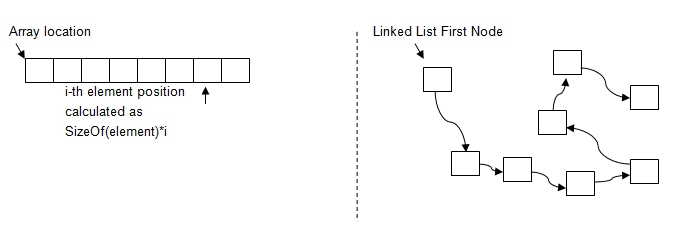
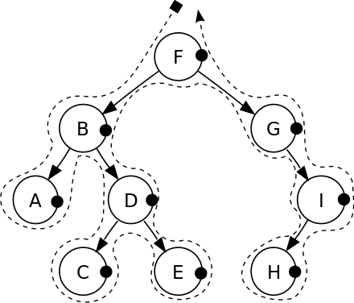

170908

# Data Structure
-	Linked List  
-	Tree  

## Linked List


## Array vs Linked List



## Array vs Linked List

-	Size => Fixed	vs Dynamic  
-	Insert => Hard vs	Easy  
-	Deletion => Hard	vs	Easy  
-	Random Access(원하는 곳에 한번에 접근할 수 있다) => Allowed	vs Not allowed  
-	Extra memory space => doesn't need vs	required  

<table style="border: 1px solid black;">
	<tr>
		<th>Array</th>
		<th>vs</th>
		<th>Linked List</th>
	</tr>
		<tr>
		<th>o(1)</th>
		<th>access</th>
	<th>o(n)</th>
	</tr>
	<tr>
		<th>o(n)</th>
		<th>search</th>
		<th>o(n)</th>
	</tr>
	<tr>
		<th>o(n)</th>
		<th>insert</th>
		<th>o(1)</th>
	</tr>
	<tr>
		<th>o(n)</th>
		<th>remove</th>
		<th>o(1)</th>
	</tr>
</table>

## Create Linked List

```js
function LinkedList(){
	//define Node
	var Node = function(element){
		this.element = element;
		this.next = null;
	};

	var length = 0;
	var head = null;


	//값을 추가하는 method
	this.append = function(element){
		var node = new Node(element), current;
		
		if(head === null){
			head = node;
		}else {
			current = head;
			// current값이 null일때 까지 돌아간다.			
			while(current.next){
				current = current.next;
			}
			// 마지막값에 node를 집어넣는다.
			current.next = node;
		}
		length++;
	};

	//특정 위치의 값을 제거하는 method
	this.removeAt = function(position){
		if(position > -1 && position < length){
			var current = head, previous, index=0;

			if(position === 0){
				head = current.next;
			}else {
				while(index++ < position){
					previous = current;
					current = current.next;
				}
				// 이전값을 덮어 씌운다.
				previous.next = current.next;
			}
			// 값이 1개 지워졌음으로 1 감소.
			length--;
		
			return current.element;
		}else {
			return null;
		}
	};

	// 값을 추가한다.
	this.insert = function(position, element){
		if(position >= 0 && position <= length>){
			var node = new Node(element), current = head, previous, index = 0;
			
			//head 에다가 insert를 해주려고 할떄
			if(position === 0){
				node.next = current;
				head = node;
			} else {
				while(index++ < position){
					previous = current;
					current = current.next;
				}

				node.next = current;
				privious.next = node;
			}
			length++;

			return true;
		}else {
			return false;
		}
	};
	
	// remove 요소를 제거한다.
	this.remove = function(element){
		var index = this.indexOf(element);
		return this.removeAt(index);
	};

	this.indexOf = function(element){
		var current = head, index = 0;

		while(current){
			if(element === current.element ){
				return index;
			}
			index++;
			current = current.next;
		}
		return false;
	};

	this.isEmpty = function(){
		return length === 0;
	};

	this.size = function(){
		return length;
	};

	this.toString = function(){
		var current = head, string = '';

		while(current) {
			string += current.element;
			current = current.next;
		}
		return string;
	};

	this.getHead = function(){
		return head;
	};


}

```

## Tree


-	root: 2  
-	level: (0 ~ 3)  
-	child of 2: 7,5  
-	subtree: 6,5,11  
-	Node: (9)  
-	edge: (8)  

## Binary Search Tree
2진 탐색 트리이다. 왼쪽에는 작은값 오른쪽에는 큰 값이 존재한다.

```js

function BinarySearchTree(){
	var Node = function(key){
		this.key = key;
		this.left = null;
		this.right = null;
	};

	var root = null;


	function insertNode(node, newNode){

		if(newNode.key < node.key){
			if(node.left === null){
				node.left = newNode;
			}else {
				insertNode(node.left, newNode);
			}
		}else {
			if(node.right === null){
				node.right = newNode;
			}else {
				insertNode(node.right, newNode);
			}
		}
	};

	this.insert = function(key){
		var newNode = new Node(key)

		if(root === null){
			root = newNode;
		}else {
			insertNode(root, newNode);
		}
	};

}
```

## Binary Search Tree - inOrderTraverse
- 왼쪽 가운데 오른쪽 순서로 탐색한다.
  

```js
	var inOrderTraverseNode = function(node, callback){
		if(node !== null){
			inOrderTraverseNode(node.left, callback);
			callback(node.key);			
			inOrderTraverseNode(node.right, callback);
		}
	}

	this.inOrderTraverse = function(callback){
		inOrderTraverseNode(root, callback);
	};
```

## Binary Search Tree - preOrderTraverse
- 가운데 왼쪽 오른쪽 순서로 탐색한다.
  

```js
// preOrderTraverse

function BinarySearchTree(){
	var Node = function(key){
		this.key = key;
		this.left = null;
		this.right = null;
	};

	var root = null;


	function insertNode(node, newNode){

		if(newNode.key < node.key){
			if(node.left === null){
				node.left = newNode;
			}else {
				insertNode(node.left, newNode);
			}
		}else {
			if(node.right === null){
				node.right = newNode;
			}else {
				insertNode(node.right, newNode);
			}
		}
	};

	this.insert = function(key){
		var newNode = new Node(key)

		if(root === null){
			root = newNode;
		}else {
			insertNode(root, newNode);
		}
	};

	// preorderTraverse

	var preOrderTraverseNode = function(node, callback){
		if(node !== null){
			callback(node.key);
			preOrderTraverseNode(node.left, callback);
			preOrderTraverseNode(node.right, callback);
		}
	}

	this.preOrderTraverse = function(callback){
		preOrderTraverseNode(root, callback);
	};

	function printNode(value) {
		console.log(value);
	}
}
```


## Binary Search Tree - postOrderTraverse
- 오른쪽 가운데 왼쪽 순서대로 탐색한다.


```js
	var postOrderTraverseNode = function(node, callback){
		if(node !== null){
			postOrderTraverseNode(node.right, callback);
			callback(node.key);						
			postOrderTraverseNode(node.left, callback);
		}
	}

	this.postOrderTraverse = function(callback){
		postOrderTraverseNode(root, callback);
	};
```

## Binary Search Tree - find min/max value

```js

	this.min = function(){
		return minNode(root);
	};

	var minNode = function(node){
		if(node){
			while(node && node.left !== null){
				node = node.left;
			}

			return node.key;
		}
		
		return null;
	};


	this.max = function(){
		return maxNode(root);
	};

	var maxNode = function(node){
		if(node){
			while(node && node.right !== null){
				node = node.right;
			}

			return node.key;
		}
		
		return null;
	};
```

## Binary Search Tree - find specific value
- 특정 값을 찾기

```js

	this.search = function(){		
		return searchNode(root, key);
	};

	var serachNode = function(node, key){
		if(node === null){
			return false;
		}
		if(key < node.key){
			return searchNode(node.left, key);
		} else if(key > node.key){
			return searchNode(node.right, key);
		} else {
			return true;
		}
	}

console.log(tree.search(1) ? 'Key 1 found.' : 'Key 1 not found.');

```

## gulp

```bash
$ npm install --save-dev gulp-imagemin

```

## gulp-imagemin : image minify

```js
gulp.task("imagemin", function(){
	pump([
		gulp.src(publicPath.src + 'img/*.jpg'),
		imagemin(),
		gulp.dest(publicPath.dest + 'img/')
	]);
});
```

## css minify(gulp-clean-css) : css minify

```js
gulp.task("cleancss", function(){
	pump([
		gulp.src(publicPath.src + 'css/minify.css'),
		cleancss(),
		gulp.dest(publicPath.dest + 'css/')
	]);
});
```

## gulp-sass : convert .scss to .css

```js
gulp.task("sass", function(){
	pump([
		gulp.src(publicPath.src + 'sass/*.scss'),
		sass().on('error', sass.logError),
		gulp.dest(publicPath.dest + 'css/')
	]);
});
```

## gulp-concat-css : concatenate css files

```js
gulp.task("concatcss", function(){
	pump([
		gulp.src([publicPath.src + 'css/concat1.css', publicPath.src + 'css/concat2.css']),
		concat('concatenated.css'),
		gulp.dest(publicPath.dest + 'css/')
	]);
});
```

## clean(del)

```js
gulp.task("clean", function(){
	return del.sync([publicPath.dest + 'js/*.js', publicPath.dest + 'css/*.css', publicPath.dest + 'img/']); 
});
```


## watch

```js
gulp.task("watch", function(){
	gulp.watch("public/src/*.js", ["uglify"]);
});

gulp.task("default", ["uglify", "watch"]);
```

## watch

```js
gulp.task("watch", function(){
	gulp.watch(publicPath.src + 'js/*.js', ["uglify", "concat"]),
	gulp.watch(publicPath.src + 'css/*.css', ["cleancss", "concatcss"]),
	gulp.watch(publicPath.src + 'img/*.jpg', ["imagemin"]),
	gulp.watch(publicPath.src + 'sass/*.scss', ["sass"])
 +});
```